# U1 软件开发与建模
- 软件开发方法
- 模型与建模
- 系统模型和过程模型
- 统一软件开发过程

## 软件与软件开发
- 软件
  - 计算机系统中的程序及其文档
- 程序
  - 是计算机处理的数据和处理规则的描述
- 文档
  - 是为了理解程序所需要的资料的说明
- 软件开发
  - 是将用户对计算机的需求转换为软件产品的过程


## 软件开发过程
- 软件生存期
  - 从软件的需求定义到使用终止的整个时间区间
- 软件开发过程
  - 狭义地仅包括系统需求分析、系统设计、软件需求分析、软件构架设计、软件详细设计、软件编码、软件集成、软件测试、系统集成和验收所需要的安装和支持等技术活动
  - 广义地还包括与这些活动有关的管理和支持活动
- 软件开发过程的核心活动
  - 需求的获取和分析、设计、实现和测试。
- 过程(process)
  - 一般指的是一系列**活动**、任务和它们之间的关系，它们共同把一组输入转换成所需要的输出。
  - 活动是过程的组成元素，而任务是活动的基本元素，一项活动由若干任务构成。
- 软件过程
  - 一般是软件生存期过程的简称，指的是跨越整个生存期的系统开发、操作和维护中所需实施的过程、活动和任务
- 最简单的软件开发过程
  
- 稍复杂的软件开发过程
  


## 软件开发过程中建模的必要性
- 在软件开发期间所产生的中间描述或文档称为**模型**
  - 模型展现系统的抽象视图，突出了系统设计的某些重要方面，而忽略了大量的低层细节
  - 模型比系统的代码更容易理解，通常用模型来阐明系统的整体结构或体系结构
- 模型有助于处理软件开发中的复杂性
  - 系统要作为整体来理解可能过于复杂，模型则提供了对系统重要方面的简明描述
  - 通过构建系统多种蓝图，模型为参与开发的多方面人员提供了一种沟通交流手段


## 模型与建模
- 模型（Model）
  - 是对现实的抽象或简化；是为了特定的目的，对实际系统进行抽象的结果
  - 这个目的确定了什么应该包含在某个模型中，什么是与该模型无关的而不应当出现在模型中
  - 模型提供了系统的蓝图
  - 一个系统可以从不同方面用不同的模型描述
    - 结构，行为
  - 模型提供了更高层次的抽象
- 建模（Modeling）
  - 建模是一种被证明正确的、广泛接受的工程技术
  - 建模是创建抽象概念的行为
  - 模型是建模的结果
  - 建模应该从建模的目的出发，突出所关注的最重要的东西而舍弃不需要的内容，才能为我们深入地考虑问题、研究方案创造条件


## Questions
- 要建立哪些模型？
- 怎么表示模型？
- 如何组织建立的模型？


## 软件开发的方法学
1. 过程模型
   - 软件开发方法定义了开发过程中应当进行的活动，并说明了如何进行这些活动和这些活动的次序
   - 这些**活动和次序**定义了一个开发过程的过程模型
2. 方法的语言
   - 软件开发方法定义了有助于开发一个系统的若干模型和这些模型的表示法，可以使用这些模型在一定的抽象层次上描述系统的特定方面，使我们能够在一个适宜的高度层次上考虑、研究问题，对系统进行分析、设计，而不致过早地陷入底层细节
   - 这些**模型的语义和表示法**一般称为方法的语言


## 系统模型
- 系统模型描述的是要开发的系统的抽象
  - 系统模型是从一个特定视角对系统进行的抽象，它在选定的视角和精度上描述了整个系统或系统的某个部分
  - 在软件开发过程中建立的系统模型有着不同的抽象层次
    - 在项目早期建立的主要是一些高层模型，用于集中涉众的思路
    - 随着开发工作的进展，这些模型将被更精确的需求模型、分析模型和设计模型所取代
    - 在需求建模、分析建模和设计建模中，开始建立的模型描述的也是一些主要的概念和结构，随着时间的进展，不断地细化，增加一些新的内容，才发展成为最终的模型


## 过程模型
- 过程模型描述的是开发一个系统需要进行哪些活动和以怎样的方式组织这些活动的抽象
  - 1970年Royce提出的瀑布模型
  - 1988年Boehm提出的螺旋模型
  - Rational公司提出的统一过程
    - Rational Unified Process，RUP
  - OPEN联盟提出的OPEN过程
  - 敏捷联盟提出了敏捷建模
    - Agile Modeling，AM


## 软件开发方法
- 结构化开发方法
  - 把系统看作是由性质不同的数据和功能两部分组成，并以此来构造系统。
  - **基于功能的方法**把功能放在第一位，强调从最顶层的功能出发，自顶向下，将上一层的每个功能分解为下一层的一个或多个功能的组合的方式，逐步求精，构建起一个以功能模块为基础的系统；
  - **基于数据的方法**认为，在系统中功能是易变的而数据的结构更稳定，因而强调在构建系统时应当首先对系统中可能存在的数据结构进行分析，然后再进行功能模块的分解。
- 面向对象开发方法
  - 基本哲理：对象是封装了数据和功能的统一体，世界是由各种各样具有自己的运动规律并相互作用的对象所组成，软件也应当按照这种模式来构造。
  - 面向对象方法可以看作是从对象的视角观察世界、描述世界，并进而导出以对象作为基础来构造系统的一种方法学。
  - 把数据和对这些数据的操作封装在一起，可以把软件做得更加模块化；这些模块具有更好的自主性、凝聚性和可重用性，更便于组成稳定的、健壮的系统结构

### 结构化开发方法——基础记账系统
- **数据流图**表达了用户输入的数据如何通过加工处理转换为所需要的数据
  
- **模块结构图**表达了程序是由哪些模块组成和这些模块之间的关系
  

### 面向对象开发方法——基础记账系统
- **类图**描述了一个系统运行时可以创建什么对象和这些对象可以有什么特征
  
- **顺序图**说明了在运行时创建的这些对象可以执行的行为
  


## 模型与建模
- 软件开发的过程就是围绕着如何建立模型展开的
  - 在需求获取和分析中，可以通过建立**需求模型**和**分析模型**，把注意力集中到用户的需求上，认真研究用户的需求和相关的业务规则
  - 在设计活动中，可以通过**设计模型**，研究多种设计方案的利弊，形成一个最适合用户需求的设计方案，指导设计工作
  - 在实现过程中，**实现模型**可以清晰地展示组成系统的各个部分之间的关系，为配置和部署系统提供依据
  - 整个软件开发过程表现为这些模型的不断建立、修改、细化
- 建立有用的模型
  - 根据需要来确定在软件开发中究竟该建立哪些模型
  - 首先要有确定的目的，从目的出发，对所关注的问题进行抽象和简化，选择适当的模型元素作为模型的构造件，来构建模型。
  - 好的模型只包含为达到这个目的所需要的内容：没有多余的不需要的内容，也没有漏掉所需要的内容。
- 模型和文档并不是一回事
  - 建模是创建抽象概念的行为，是在编码之前思考的过程，模型是建模的结果；文档是信息的持久记录
  - 模型可以没有文档，文档也可以没有模型。


## 统一过程
- UP的阶段和核心工作流
  
- 迭代和增量开发
  
- Schedule-oriented terms in the UP
  - Notice that one development cycle is composed of many iterations.

  

### UP的阶段和工作流


### UP的主要特征
- 用例驱动
  - “用例”指的是根据用户完成工作任务的需要，组织在一起的、能够向用户提供有价值的结果的一组功能。
  - 用例驱动强调开发过程应该沿着确定和实现用例的工作流进行：用例被确定、被设计、被实现，最后用例又成为测试人员构造测试实例的依据
- 以构架为中心
  - 构架展示了系统的整体设计；以构架为中心，强调要以这个整体设计为目标，组织开发，协调开发，控制开发。
- 迭代和增量的开发
  - “迭代”指的是工作流中的步骤；“增量”指的是产品中增加的部分


## 小结


# U2 统一建模语言UML概览
- 建模语言
- UML是什么
- 模型、图、视图
- 怎么用UML

## 系统设计与建模
- 任何合理大规模的系统设计都是困难的
  - 系统可以由成百上千个软件和硬件组件组成
  - 如何跟踪需要哪些组件、它们的工作是什么以及它们如何满足客户的要求？
  - 如何与同事分享设计以确保各个部分协同工作？
- 在系统设计中，建模的一个重要原因是：管理复杂性。
- 模型是对真实事物的抽象
  - 对系统建模时，模型是真实系统的简化版，可以更快地理解、评估和批评系统的设计和可行性
- 为了有效地对系统建模，需要一种可以描述模型的语言


## What's in a Modeling Language?
- 建模语言
  - 可以包含伪代码、代码、图片、图表或长篇描述；
  - 事实上，它几乎可以是任何帮助描述系统的事物
- 构成建模语言的元素称为它的符号（notation）
- 对符号含义的描述称为语言的语义（semantics）
  - 在语言的元模型（meta-model）中捕获
- 建模语言可以是包含符号（表达模型的方式）和该符号含义的描述（元模型）的任何东西


## Why UML?
- UML has six main advantages
  1. It's a formal language 正式
     - 每个元素都有明确的含义，模型不会被误解
  2. It's concise 简洁
     - 语言由简单直接的符号组成
  3. It's comprehensive 全面
     - 描述系统的所有重要方面
  4. It's scaleable 可扩展
  5. It's built on lessons learned 建立在经验教训的基础之上
  6. It's the standard


## What's UML?
- UML, short for **Unified Modeling Language**, is a standardized modeling language consisting of an integrated set of **diagrams**, developed to help system and software developers for **specifying, visualizing, constructing, and documenting** the artifacts of software systems, as well as for business modeling and other non-software systems.


## UML2的图
UML2的图


结构图
- 类图（Class）类、类型、接口以及它们之间的关系
- 对象图（Object）类图中定义的类的对象实例
- 构件图（Component）系统中的重要构件和它们之间交互所使用的接口
- 组合结构图（Composite Structure）类和构架的内部，描述特定上下文中类的关系
- 包图（Package）类和构件的层次组织和分组
- 部署图（Deployment）系统最终如何部署到给定的现实世界环境中

行为图
- 活动图（Activity）系统中的顺序和并行活动
- 序列图（Sequence）对象之间的交互，强调交互的顺序
- 通信图（Communication）对象交互的途径以及支持交互所需要的连接
- 定时图（Timing）对象之间的交互，强调交互的计时
- 交互概图（Interaction Overview）将顺序、通信和时间图集中在一起，描述系统中发生的重要交互
- 状态机图（State Machine）对象整个生命期的状态和引起状态改变的事件
- 用例图（Use Case）系统与它的用户、其他外部系统之间的交互；映射需求到系统


## 必须掌握的图


## 模型和图
- 术语
  - 模型（model）、图（diagram）、视图（view）
  - 画图工具vs.建模工具
- 模型和图
  - 特定的一个图展示模型的某些部分，而不一定是全部
  - 模型是模型元素的集合，位于建模工具和图的背后
  - 图像是画布，可以在画布上创建新元素，然后将这些元素添加到模型中，并将相关元素组织到基础模型上的一组视图中
  - 图本身并不是模型，它只是展示模型包含的一小部分信息的方式


## 4+1视图模型
4+1 视图模型将模型分解为一组视图，每个视图捕获系统的一个特定方面


## UML核心
- UML的主要元素
  - 基本构造块
    - 事物：结构事物、行为事物、分组事物、注释事物
    - 关系：依赖、关联、泛化、实现；各种变体
    - 图：13种图
  - 规则
    - 语法和语义规则：名字、可见性、作用域、完整性，执行
    - UML建模规则：省略、不完整、不一致
  - 通用机制
    - 规格说明、装饰、划分、扩展机制（构造型、标记值、约束）


## UML体系结构
- 元元模型层（Meta-meta-model）
  - UML最基本的元素“事物（Thing）”，代表要定义的所有事物
- 元模型层（Meta-model）
  - UML的基本元素，包括面向对象和面向组件的概念
- 模型层（Model）
  - 组成了UML的模型，这一层中的概念都是元模型层中概念的实例化
  - 该层的模型通常叫做类模型（class model）或类型模型（type model）
- 用户模型层（User model）
  - 该层的每个实例都是模型层和元模型层概念的实例
  - 该层中模型通常叫做对象模型（object model）或实例模型（instance model）


## 使用UML的层次
- UML as a sketch
  - 用 UML 制作简要的草图来传达关键点
- UML as a blueprint
  - 使用 UML 图提供系统的详细规约
  - 用 UML 工具生成，这种方法通常与软件系统相关，涉及使用正向和逆向工程来保持模型与代码同步
- UML as a programming language
  - 直接从 UML 模型到可执行代码
  - 系统的每个方面都被建模


## UML在开发过程中的应用
- 需求分析
  - 用例，描述人们如何与系统交互
  - 类图，从概念角度绘制的类图，构建领域的词汇表
  - 活动图，显示组织的工作流程，显示软件和人类活动如何交互；活动图可以显示用例的上下文以及复杂用例如何工作的细节。
  - 状态图，如果一个概念在生命周期中有各种状态，并且有改变状态的事件，则状态图会有用。
- 设计
  - 类图，软件角度的类图，显示软件中的类以及它们如何相互关联
  - 序列图，从用例中挑选最重要和感兴趣的场景，并使用 CRC 卡或序列图来弄清楚软件中发生了什么
  - 包图，显示软件的组织
  - 状态图，具有复杂生命周期的类的状态图
  - 部署图，显示软件的物理布局


## UML学习路线


# U3 对象模型：UML的面向对象基础
- 对象模型
- 对象和类
- 链接和关联
- 消息和动态绑定

## 对象模型
- 对象模型是UML和面向对象编程语言的公共计算模型
  - 对象模型是一种考虑程序结构的一般方式
  - 由面向对象设计活动和编程活动的基础概念框架组成
- UML模型和面向对象程序
  - 许多UML表示法的含义可以从面向对象程序运行时的特性来理解
  - 模型是描绘代码结构和特性的抽象视图
- 对象模型的基本性质——计算是发生在**对象内**和**对象间**的
  - 对象结合了计算机程序的两个根本方面——数据和处理
    - 当程序运行时，对象一般由内存区域表示，这块内存区域包含着该对象存储的数据和其他信息
    - 对象还支持方法或函数，访问和更新对象包含的数据
  - 程序中的对象不是孤立的，而是连接在一起的，互相交互的
    - 程序必须跟踪各个对象中存储的数据之间的关系，程序的整体行为从多个不同对象的交互中显现出来
    - 对象连接在一起，具体的实现方式是通过让对象能拥有对其他对象的引用，或者是能知道其他对象的位置
- 对象模型将运行的程序视作是对象的网络
  - 对象构成网络中的结点，连接对象的弧称为链（link）
  - 每个对象包含程序数据的一个小子集，对象网络的结构则表示这些数据之间的关系
  - 对象网络的结构（或拓扑结构）是高度动态的，会随着程序的运行而改变
    - 对象可以在运行时被创建和销毁，对象之间的链也可以改变
  - 对象之间的链还可以作为对象交互的通信路径，使得对象能够通过互相发送消息（messages）进行交互


## UML模型和面向对象程序


## 对象模型在设计中的作用
- 对象模型为UML的设计表示法提供了语义基础
  - 面向对象程序的源代码不是直接描述对象网络，而是描述组成对象网络的对象的特性
    - 如给出相似对象的类（class）的结构描述来定义对象能够持有的数据和方法的执行效果
  - UML中许多特征的含义可以通过将它们解释为对相互连接的、互通消息的对象的集合的说明来理解
- 将UML设计表示法与实际的程序相关起来
  - 绘制和源代码作用相同的UML图，从一般结构上来定义程序运行时会发生什么
    - 也可以画表示对象特定运行时的配置的UML图
  - **静态图**描述对象之间可能存在的关系的种类，以及由此得到的对象网络可能具有的拓扑结构
  - **动态图**描述可以在对象之间传递的消息以及该消息对接收消息的对象的影响


## 一个库存控制的例子
- 在制造业中，某些类型的复杂产品是由**零件**装配而成的，常见需求是记录零件的库存以及这些零件的使用方式。程序必须管理描述系统中不同零件的信息。
- 除了维护零件的类型信息，系统还需要记录每个实际零件的信息，用于比如质量保证和跟踪。 假定对每个零件要记录三项信息：
  - 目录查找号（整数）； 名字（字符串）； 单个零件的成本（浮点数值）
- 零件可以被装配成更复杂的结构，称为**组件**。一个组件可以包含多个零件，而且可以具有层次结构。
- 维护零件、组件及它们的结构信息的程序有多种用途，例如维护目录和库存信息，记录制造的组件的结构，支持对组件的各种操作，例如计算组件中零件的总成本，或者打印组成组件的所有零件的清单。
- 需求：查询一个组件的材料成本，计算方法是累加组件中包含的零件的成本


## 类和对象
- 如何将数据划分到一组交互的对象中并支持系统功能？
  - OO系统中的数据和功能分布于系统运行时的对象之中。
  - 每一个对象都维护部分系统数据，并提供一组允许其他对象操作这些数据的方法
- 识别对象常用的经验准则
  - 用模型中的对象表示应用领域的现实世界对象
  - 库存控制系统的任务之一是跟踪记录库存中的所有零件，因此，很自然的起点就是将每一个零件表示为系统中的一个对象
- 同一种实体的一组对象的公共结构由类描述
  - 作为库存管理系统设计的第一步，可以考虑定义一个part类。


## Part类的Java代码
- 确定了类之后，考虑该类的实例中应该放些什么数据
  - 在Part类中，自然的想法是每个对象应该保存关于该零件的信息，即零件的名字、编号以及成本。

```java
public class Part {
    private String name ;
    private long number ;
    private double cost ;
    public Part(String nm, long num, double cst) {
        name = nm ; number = num ; cost = cst ;
    }
    public String getName() { return name ; }
    public long getNumber() { return number ; }
    public double getCost() { return cost ; }
}
```


## Part类的UML表示
- UML类定义了
  - 特征（feature）
    - 细分为属性（attribute）和操作（operation）
  - 属性定义类实例存储的数据
  - 操作定义类实例的行为


## 对象创建
- 类在编译时定义，对象在运行时作为类的实例创建
- 创建一个新Part对象的Java语句
  ```java
  Part myScrew = new Part("screw", 28834, 0.02) ;
  ```
- Part对象的UML表示
  


## 对象的特性
- 对象是具有状态、行为和唯一标识的某事物
- 状态（state）
  - 包含在对象属性中的数据值通常称为对象的状态
  - 这些数据值会随系统变化而改变，结果是对象的状态可以改变
  - 在OOPL中，对象的状态由对象所属类定义的域指定，在UML中由类的属性指定
- 行为
  - 在OOPL中，对象的操作在类中定义为一组方法，即接口
  - 在UML中，操作不出现在对象图标中
- 唯一标识（identity）
  - 对象模型假定为每个对象提供唯一标识，作为区别于其他对象的标志。
  - 每个对象和其他所有对象都是可区别的，即使两个对象保存完全相同的数据，并在接口中提供完全相同的操作集合。
    - 下面的代码创建两个状态相同的对象，但它们是不同的对象。
      ```java
      Part screw1 = new Part("screw", 28834, 0.02) ;
      Part screw2 = new Part("screw", 28834, 0.02) ;
      ```
  - 对象的标识是对象模型固有的一部分，不同于对象中存储的任何其他数据项。 设计人员不需要定义一个特殊数据来区分类的各个实例。
    - 有时应用领域会包含对每个对象都不相同的真实数据项，例如各种识别号码，这些数据项通常作为属性建模。


## 避免数据重复
- 对零件建模的方法简单直接，实用吗？
  - 缺点是描述给定类型零件的数据是重复的
- 至少存在着三个问题
  - 数据高度冗余，耗费存储
  - 数据的重复可能会导致维护问题
    - 如果零件的成本变了，每个受影响的对象中的成本属性都需要更新
  - 需要永久保存零件的目录信息
    - 在某些情况下，特定类型的零件对象可能不存在，例如，零件还没有制造出来。倘若这样，就没有地方保存目录信息。
    - 不可能容许只有在零件存在时才能保存目录信息


## 零件类的新设计
- 另一种设计方法
  - 将描述给定类型零件的公共信息保存在另外的对象中
  - 这种“描述符”对象并不表示单个零件，而是表示与描述一类零件的目录条目（catalogue entry）相关的信息
  - 新设计要求，对于每种不同类型的零件，都有一个目录条目对象，用来保存该类型零件的名字、查找号和成本。
  - Part对象不再保存数据。要查找一个零件，需要访问描述该零件的目录条目对象。


## 目录条目描述的零件
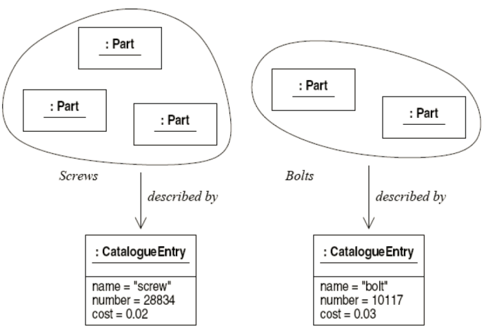


## 零件类的新设计（续）
- 这种设计解决了上列3个问题
  - 数据只存储在一处，因而没有冗余。
  - 修改给定种类零件的数据很直接
    - 如果某种零件的成本改变了，只需要更新一个属性，即相应的目录条目对象中的成本属性。
  - 目录条目对象，即使在没有Part对象与之相关联时，也可以存在，因而解决了在创建零件之前如何保存零件信息的问题。


## 链（link）
- 库存控制程序的设计包括了两类的对象
  - 目录条目对象保存适用于给定类型的所有零件的信息
  - 每个零件对象表示一个实际零件
- 这两个类之间存在的关系
  - 为了获得对零件的完整描述，需要查看的不仅是零件对象，还要查看相关的描述零件的目录条目对象。
  - 这意味着对每个零件对象，系统必须记录哪个目录条目对象在描述它
  - 实现这种关系一般方法是每个零件对象包含一个到相关目录条目的引用，如下列Java代码所示

```java
public class CatalogueEntry {
    private String name ;
    private long number ;
    private double cost ;
    public CatalogueEntry(String nm, long num, double cst) {
        name = nm ; number = num ; cost = cst ;
    }
    public String getName() { return name ; }
    public long getNumber() { return number ; }
    public double getCost() { return cost ; }
}
public class Part {
    private CatalogueEntry entry ;
    public Part(CatalogueEntry e) { entry = e ; }
}
//-----------------------------------------------
CatalogueEntry screw = new CatalogueEntry("screw", 28834, 0.02) ;
Part s1 = new Part(screw) ;
Part s2 = new Part(screw) ;
```

- 链的UML表示法
  - 对象保存另一对象的引用，在这两个对象之间画一个链来表示
  - 链表示为从保存引用的对象指向被引用对象的箭头，箭头表示只能在一个方向上遍历或导航；
  - 在箭头上可以标示保存引用的域的名字；

  


## 对象图（object diagram）
- 对象图展现对象和对象之间的链
  - 对象图是以可视形式表示对象网络结构的一种方式，它给出了系统中的数据在给定时刻的一个“快照”。
  - 在相互链接的对象结构中，信息用两种不同的方法记录：
    - 一些数据作为属性保存在对象中
    - 另一些信息在结构上依靠链保存的
    - 例如，零件属于给定类型的事实是通过零件对象和相应的目录条目之间的链表示的：系统中并没有明确记录零件的类型的数据项。


## 关联（association）
- 关联和链
  - 如同用类定义一组相似对象的公共结构一样，对象之间的链的共同特性通过相应的类之间的关系定义
- 在UML中，类之间的数据关系称为关联
  - 链是关联的实例，就如同对象是类的实例一样


## 类图（class diagrams）
- 类图中包含类和关联
  - 对象图显示系统的对象网络结构的许多特定状态，类图则以一种更一般的方式指定了系统的任何合法状态都必须满足的特性。
- 如果对象图满足类图中定义的各种约束，那么对象图是类图的实例
  - 例如，上图表示库存控制系统的对象图可以包含“Part”和“CatalogueEntry”类的实例，并且每个Part对象必须链接到恰好一个CatalogueEntry 对象
  - 假如程序中存在两个目录条目间的链接，或者零件没有链接到一个目录条目，就会出现错误，程序处于非法状态


## 消息传递
- 面向对象程序中的数据是分布在系统的对象之中的
  - 一些数据作为属性值保存
  - 对象之间的链接也含有信息，描述对象之间保持的关系
- 信息分布意味着为了完成系统的任何功能，一般而言都需要多个对象进行交互
  - 假设想要为Part类增加一个方法cost来查询一个零件的成本；
  - 表示零件成本的数据值并没有保存在零件对象中，而是保存在零件引用的目录条目对象中
  - 新方法必须调用目录条目类中的getCost()方法

```java
public class Part {
    public double cost() { return entry.getCost(); }
    private CatalogueEntry entry ;
}
//如果客户持有一个Part的引用并要查询它的成本
//可以如下调用cost方法。
Part s1 = new Part(screw);
double s1cost = s1.cost();
```

- UML将方法调用表示为从一个对象发送到另一对象的消息
  - 当对象调用另一对象的方法时，可以看作是请求被调用的对象执行某些处理，这个请求作为消息建模。
  - 上面的代码中调用s1.cost()的消息如图
    
- 对象在接收到消息时，通常会以某种方式响应
  


## 多态性
- 库存控制程序还必须能够记录零件如何装配成组件
  


## 关联名
- Assembly和Part之间的关联
  - Assembly中包含哪些Part，用连接组件对象和零件对象的链表示
  - 这些链用了关联名“contains”标示，没有用角色名
  - 关联名描述链接的对象之间具有什么关系


## Assembly怎么建模？
- 将组件简单地作为一组零件建模是不够的
  - 组件可以有层次结构，零件能够装配为子组件，子组件可以和其他子组件与零件装配在一起，形成更高层次的组件
- 为了实现层次结构，组件必须能包含零件和其他组件

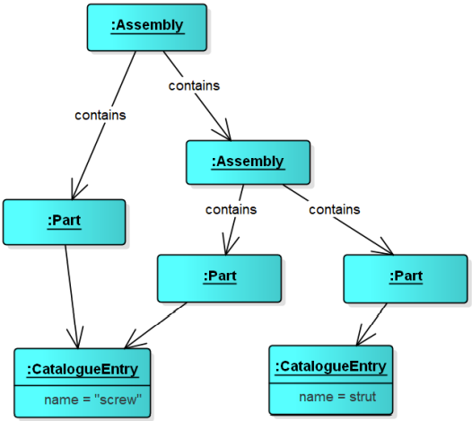


## 多态性的实现
- UML是强类型的，不允许链接连接任意类的对象
  - 对上图所示的多态链接，必需指定能够参与链接的类的范围
- 通常的实现方法是定义一个更一般的类，并说明希望链接的特殊类是这个一般类的特化。
  - 库存控制程序中想要建立的模型是：组件能由构件组成，而每个构件可以是一个子组件或是一个零件。这样就能够规定‘contains’链接把组件对象连接到构件对象，而按照定义，构件对象要么是Part对象，要么是表示子组件的其他Assembly对象。


## Java中多态性的实现
- 在面向对象语言中，使用继承机制实现多态性
  - 定义一个构件类Component，将Part类和Assembly类定义为Component类的子类

```java
public abstract class Component { ... }
public class Part extends Component { ... }
public class Assembly extends Component {
    private ArrayList<Component> components = new ArrayList<>() ;
    public void add(Component c) { components.add (c) ; }
}
```


## UML中的多态性
- 多态性的Java实现由两种不同机制相互作用而产生
  - 第一，定义Assembly类使得它能够保存对多个构件对象的引用
  - 第二，用继承定义子类，表示现有的不同类型的构件
- UML的特化（specialization）和泛化（generalization）
  - Java的“extends”关系在UML中用类之间的特化关系表示：如果类E是通过扩展类C而定义的，那么就说E是C的特化。
  - 如果从超类比子类有更大范围的关系的角度看，这种关系也被称为泛化：等价的描述可以说C是E的泛化。


## 构件之间的泛化关系
- 泛化和关联的不同
  - 泛化没有在对象图中出现的“实例”
  - 关联描述的是对象能够链接到一起的方式，泛化描述的则是一个类的对象能被另一类的对象替换的情形。
  - 重数的概念不适用于泛化，一般也不标注泛化关系


## 层次结构Assembly的模型


## 层次中的消息传递


## 动态绑定（dynamic binding）
- 动态绑定、晚绑定（late binding）
  - 当接收到一个‘cost’消息时，实际进行的处理将依赖于消息是发送给了Assembly对象还是Part对象
  - 实质上，是消息的接收者而不是发送者，来决定执行什么代码响应所发送的消息
  - 在多态的情况下，消息接收者的类型可能直到运行时才可以知道，因而，响应消息所执行的代码只能在运行时选择
  - 在Java中，只要在Component类中声明cost函数，然后在Part类和Assembly类中重写cost函数，为各个类提供需要的功能
  - 在C++中，就必须使用虚函数机制


## 小结
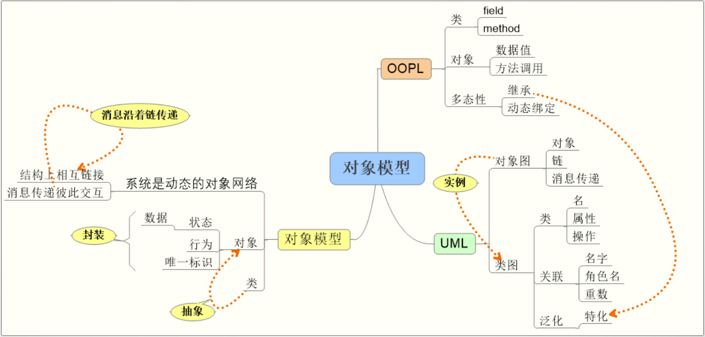


# U4 类图和对象图：对系统的逻辑结构建模
- 类
- 关系
- 类图
- 对象图

## 类图和对象图
- 系统的静态模型描述系统所操纵的数据块在结构上的关系
  - 描述数据如何分配到对象中，这些对象如何分类，它们之间可以具有什么关系。
  - 不描述系统的行为，也不描述系统中的数据如何随时间演变
- 类图和对象图是两种最重要的静态模型
  - 对象图提供系统的一个“快照”，显示在给定时间实际存在的对象以及它们之间的链接
  - 类图是一种系统规约，规定可以存在什么类型的对象，这些对象封装什么数据，系统中的对象如何彼此关联在一起


## 类（class）
- 抽象（Abstraction）
  - 类的定义中包含的是对建模者和正在建模的系统很重要的信息
  - 专注于系统需要了解的信息，而不是陷入与系统无关的细节中
  - 在给定的上下文中丢弃不相关的细节称为抽象
- 封装（Encapsulation）
  - 对象封装了数据和处理该数据的操作
  - 封装使类能够向外部世界隐藏其工作方式的内部细节，只公开可访问的操作和数据
- 最简单的，一个类的描述包括两部分信息
  - 类的对象将包含的**状态**信息和**支持**的行为
- UML的类表示法
  


## UML中的类
- 使用 UML 表示类的四种不同方式
  


## 可见性（visibility）
- 可见性特征用于控制对属性、操作甚至整个类的访问，以有效地实施封装
- UML 的四种不同的可见性分类
  

### public（+）
- pragmatics
  - 如果希望任何其他类可以直接访问某个属性或操作，将其声明为public。
- 类的public接口
  - 类的公共接口由其他类可以访问和使用的属性和操作组成
  - 类的公共接口应该尽可能少更改，以防止正在使用该类的客户进行不必要的更改
- public属性？
  - 通常最好避免public属性
  - 例外的例子：当属性是可以被许多不同类使用的一个常量时

### protected（#）
- pragmatics
  - 如果希望允许子类访问基类中的属性或操作而不向整个系统开放该属性或操作，使用protected可见性
- protected与继承
  - protected元素可以由所在类的方法访问，也可以由继承该类的子类的方法访问
  - 与Java不同之处：与类同一包中，但不是其子类，不能访问其protected成员

### package（~）
- pragmatics
  - 想要跨类声明只能在包内使用的方法和属性的集合时，使用package可见性
- package可见性
  - 类中声明为包可见性的属性或操作，同一包中的任何类都可以直接访问该属性或操作。

### private（-）
- pragmatics
  - 如果不希望系统的其他部分依赖某个属性或操作，则声明为private可见性
  - 如果打算稍后更改属性或操作，但不希望引起有权访问该元素的其他类的变更，可能就是这种情况
- private可见性和private属性
  - 只有包含私有元素的类才能查看或处理存储在私有属性中的数据或调用私有操作
  - 经验法则是属性应该始终是私有的；例外是需要与子类共享属性时使用protected


## 类的属性（attribute）
- 类的属性是表示对象状态的信息
- 属性的完整语法 `visibility name : type multiplicity = default {property-string}`
  
- 内联属性和关联属性
  


## 重数（multiplicity）
- 属性表示的对象个数
  - 一个属性可以表示任意数量的该类型的对象；在程序中，这就像声明一个属性是一个数组。
  - 重数指定一个属性实际上代表一个对象的集合，可以应用于内联属性和关联属性
- 常用属性重数值
  - `1`
  - `0..*(*)`
  - `0..1`

  


## 类的操作（operation）
- 类的操作描述了该类对象的行为
  - 操作描述可以做什么，但不一定描述如何做
  - 类的操作集合应该完全包含该类的所有行为，包括维护该类属性的所有工作以及可能与该类密切相关的附加行为
- 操作的完整表示语法 `visibility name (parameter-list) : return-type {property-string}`
  


## 组织属性和操作
- 构造型（stereotype）
  
- 类的责任（responsibility）
  - 责任是类的契约或义务

  


## Instance and Static Scope
- 实例和静态作用域
  - 特征的作用域指定类的每个实例是否具有自己独特的特征值，或者是否只有一个特征值由所有类实例共享
  - 可以为类的属性和操作指定作用域，UML中有两种owner scope
- 实例（instance）
  - 类的每个实例都拥有自己的特征值。 默认设置，不需要额外符号
- 静态（static）
  - 对于类的所有实例，只有一个特征值。 也被称为类作用域
  - 通过在功能字符串下划线表示


## static特征
- static属性和操作
  - UML中的操作和属性可以声明为static
  - 表示法：加下画线
- 应用示例：Singleton 设计模式
  - 该设计模式确保在系统的生命周期内只构造特定类的一个对象
  - 为了确保只构造一个对象，单例模式的典型实现是持有对单个对象实例的内部静态引用，并使用静态操作控制对该实例的访问
- 类的重数表示法


## 建模技术
- 类常用来对问题或解决方案中的抽象建模
  - 系统词汇、系统中职责的分布、数据类型
- 系统词汇建模
  - 确定用户或实现者用来描述问题或解决方案的事物
    - 使用 CRC 卡和基于用例的分析有助于找到这些抽象
  - 对于每个抽象，确定一组职责
    - 确保每个类都有清晰的定义，并且所有类之间的职责平衡良好
  - 为每个类提供执行这些职责所需的属性和操作
  - 例：零售系统的系统词汇建模


## 类图中的关系（relationship）
- 关联、聚合、组合
- 泛化（generalization）
- 依赖（dependency）
- 实现（realization）


## 类之间的关系


## 类关系
- UML 的5种不同的类关系
  - 类关系的强度取决于关系涉及的类彼此之间的依赖程度
  - 两个相互强烈依赖的类被认为是紧密耦合的； 对一个类的更改很可能会影响另一个类


## 依赖（dependency）
- 想说明一个事物使用另一个事物时，选择依赖
  - 依赖关系表明一个事物使用另一事物的信息和服务，但反之不然
  - 例如，一个类使用java.lang.Math类，用依赖关系
- 类之间的依赖关系
  - 一个类使用另一个类的操作，或使用另一个类类型的变量或参数
- 依赖的图形表示
  


## 建模技术
- 简单依赖关系建模
  - 一种常见的依赖关系连接一个类和作为其操作参数的另一个类
  - 要对此使用关系建模，依赖从操作所在的类指向操作的参数所属的类
  - 例，选课管理系统中抽取的类：从 CourseSchedule 到 Course 的依赖关系，其中 Course 用于 CourseSchedule 的添加和删除操作。
    


## 关联（association）
- 关联
  - 一种结构关系，指定一个事物的对象与另一事物的对象相连。
  - 给定连接两个类的关联，可以将一个类的对象与另一类的对象相关联
  - 关联意味着一个类实际上将以属性的形式包含对另一个类的一个或多个对象的引用
- 关联的类型
  - 自关联，二元关联，n元关联

  


## 关联的修饰
- 名字（name）
  - 关联名描述关联的性质
  - 读名字的方向，无歧义的情况下不需要

  
- 导航（navigation）
  - 给定一个 User对象，能够找到相应的Password对象；
  - 给定一个Password对象，不能找到对应的User

  
- 角色（role）
  - 参与关联的类在关联中扮演的角色
  - 角色可以命名，也叫做end name

  
- 重数（multiplicity）
  - 说明一个关联实例（链）可以连接多少个对象
  - 这个“多少”被称为关联角色的重数
  - 用一个整数范围表示，指定相关对象集可能的大小
    - `0..1`
    - `0..*(*)`
    - `1`
    - `m..n`
    - `m,n`

    
- 可见性（visibility）
  - 给定一个User对象，可以访问Password
  - 给定一个 UserGroup 对象，可以导航到它的 User 对象，反之亦然；但无法从这个链查看 User 对象的 Password 对象； 因为它们是User私有的。

  
- 聚合（aggregation）
  - 有时想要对“整体/部分”关系建模，其中一个类代表一个更大的事物（“整体”），它由较小的事物（“部分”）组成。
  - 这种关系称为聚合，代表一种“has-a”关系，意思是整体的对象有部分的对象。
  - 聚合实际上只是一种特殊的关联

  
- 组合（composition）
  - 简单聚合是概念性的，只是区分“整体”和“部分”，不会改变整体和部分之间关联的导航含义，也不会链接整体和部分的生命周期。
  - 组合是一种更强的聚合形式，一个部分对象只能属于一个整体复合对象；在复合对象中，整体对象必须管理其部分的创建和销毁

  
- 限定关联（qualification）
  - 限定符（qualifier）

  


## 关联类（Association Class）
- 关联类
  - 在两个类之间的关联中，关联本身可能具有属性

  
- 关联类同时具有关联和类的特性
  


## 课堂练习

### 关联和重数
- Define multiplicities for the following associations:
  - (a) ‘Has on loan’, linking people to books in a library system.
  - (b) ‘Has read’, linking people to books.
  - (c) ‘Is occupying’, linking chess pieces to squares on a chess board.
  - (d) ‘Spouse’, linking class ‘Person’ to itself.
  - (e) ‘Parent’, linking class ‘Person’ to itself.

### 阅读类图


### 结构型关系


### 类和关系建模
- Draw a class diagram summarizing the following facts about a library.

For each book held by the library, the catalogue contains the title, author’s name and ISBN number of the book. There may be multiple copies of a book in the library. Each copy of a book has a unique accession number. There are many registered readers belonging to the library, each of whom is issued with a number of tickets. The system records the name and address of each reader, and the number of tickets that they have been issued with. Readers can borrow one book for each ticket that they possess, and the system keeps a record of which books a reader has borrowed, along with the date that the book must be returned by.


## 泛化（generalization）
- 泛化关系
  - 泛化是一般事物（称为超类或父类）与更具体的事物（称为子类或子类）之间的关系。
  - 泛化有时被称为“is-a”关系：一件事物（如 BayWindow 类）是一种更一般的事物（例如，类 Window）。
  - 子类的对象可用于父类类型的变量或参数，但反之则不行。 换句话说，泛化意味着孩子可以替代父母的声明。
  - 子类继承其父类的属性和操作。 子类操作的实现覆盖父操作的实现被称为多态性。
- 特化（specialization）和继承（inheritance）
- 泛化用于描述一个类是另一个类的一种
- “has a”和“is a type of” 用来确定两个类之间的关系是聚合还是泛化
  - 如果声明一个类的一部分是另一个类的对象，那么这种关系很可能是关联、聚合或组合之一。
  - 如果说该类是另一个类的一种，那么可能需要考虑使用泛化。
- 图表示法
  - 指向父类的实线空心三角箭头

泛化 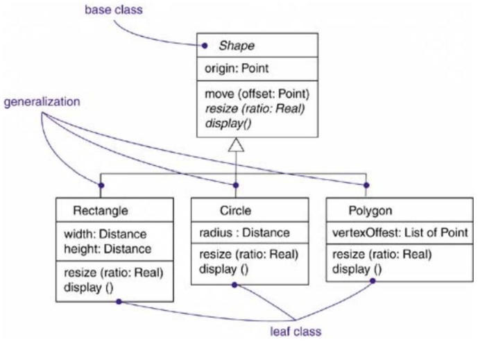

单继承和多继承 


## 建模技术——泛化和继承
- 继承建模
  - 在对系统词汇进行建模时，会遇到结构或行为与其他类相似的类
  - 可以将其中的每一个建模为不同且不相关的抽象；
  - 更好的方法是提取任何常见的结构和行为特征，并将它们放在更通用的类中，特殊的类从这些类继承。
- 建模继承关系
  - 给定一组类，查找两个或多个类共有的职责、属性和操作。
  - 将这些共有的职责、属性和操作提升为一个更通用的类；如有必要，创建一个新类，可以将这些元素分配给该类
  - 从每个特殊类到其更一般的父类建立泛化关系
- 一组从交易应用程序中提取的类
  


## 抽象类（abstract class）
- 抽象操作
  - 有时，当使用泛化来声明一个可重用的泛型类时，可能无法实现通用类所需的所有行为
  - 抽象操作不包含方法实现，它实际上是一个占位符，表示“把这个行为的实现留给子类”。
  - 如果类的任何部分被声明为抽象的，那么类本身也要声明为抽象的
- 抽象类
  - 通过用斜体书写类名称来表示


## 接口（interface）
- 接口
  - 接口是没有相应方法实现的操作的集合，非常类似于只包含抽象方法的抽象类
  - 将接口视为一个非常简单的契约，它声明“这些操作必须由打算满足此契约的类实现”。
  - 有时接口也会包含属性，此时通常是静态的并且是常量
  - 在C++中，接口被实现为不包含操作实现的抽象类；在Java 和 C#中，接口具有自己的专门构造
- 接口和抽象类
  - 接口往往比抽象类更安全，避免了与多重继承相关的许多问题
- 接口表示法
  - 构造型的类符号
    - `<<interface>>`
  - 接口图标符号


## 实现（realization）关系
- 实现接口的类和接口之间的关系
- 实现关系的表示法
  - 构造型：空心三角箭头虚线
    
  - 图标表示：实线
    


## 模板（template）
- 模板类
  - 参数化的类，泛型类
- 表示法
  


## 模板参数绑定
- 模板类的实例化
- 显式模板参数绑定
  - `<<bind>>`依赖
    
- 隐式模板参数绑定
  - 类名中加绑定表达式
    

## 类图（class diagram）
- 类图中包含的元素
  - 类、接口
  - 依赖、关联、泛化关系
  - 通用元素：注释、约束
- 类图的用途
  - 对系统词汇表建模
  - 对简单协作建模
  - 对逻辑数据库模式建模
  - 正向工程和逆向工程


## 与类图相关的图
- 对象图
  - 显示类如何在运行时作为对象实例活跃起来，显示运行时配置
- 组合结构图
  - 显示了上下文相关的类图和模式
- 序列图和通信图
  - 确定系统中类的职责后，通常会创建序列图和通信图显示各部分之间的交互
- 包图
  - 将类组织成包也很常见，包图允许在更高级别查看依赖关系，了解软件的稳定性


## 对象图（Object Diagram）
- 对象实例
- 链（link）
- 对象图


## 实例（instance）
- instance和classifier
  - A classifier is a mechanism that describes structural and behavioral features. Classifiers include classes, associations, interfaces, datatypes, signals, components, nodes, use cases, and subsystems.
  - An instance is a concrete manifestation of an abstraction to which a set of operations can be applied and which has a state that stores the effects of the operations.
- 对象是类的实例
  
- UML中实例的图形表示
  - 命名实例
    
  - 匿名实例
    


## 对象状态
- 带属性值的实例
  
- 带显式状态的实例
  


## 链（link）
- 对象之间的链
  - 对象图上的对象之间的链表明这两个对象可以相互通信。
    
- 链和关联
  - 不能将任意两个对象链接在一起。
  - 如果在两个对象之间创建链接，则类之间必须有相应的关联。
  - 对象之间的链接对应于对象的类之间的关联： 应用于关联上的约束规则，链接必须遵守。


## 课堂练习——以下对象图合法吗？


## 对象图
- 对象图主要包含对象和链接
- 对象图与类图相关
  - 类图描述一般情况，对象图描述从类图派生的具体实例
- 常见用途
  - 对系统的静态设计视图或静态交互视图建模时，对象图可以用来对静态数据结构进行建模；使用对象图建模就像使用类图一样，但是是从真实或原型实例的角度来看的
  - 建模对象结构涉及在给定的时间对系统中的对象进行快照，可以用对象图来可视化、指定、构造和记录系统中某些实例的存在，以及它们之间的关系。


## 小结


# U5 用例图（Use Case Diagram）：对系统需求建模
- 用例（Use case）
- 参与者（Actor）
- 关系（Relationship）
- 用例图和用例描述

## 用例（Use case）
- 与用例相关的关键概念
  - actors, use cases, and the subject
- Actors（参与者、施动者、行事者）
  - 可能与主体交互的用户和其他系统被表示为参与者
  - 参与者对系统外部的实体建模
- Use cases（用例）
  - 所需的主体行为由一个或多个用例规定
  - 用例根据参与者的需要而定义
- Subject（主题、主体）
  - 正在被开发的系统，用例应用于该系统


- 用例是面向对象系统开发的起点
  - 分析、设计、测试和文档化
  - 用例为开发人员提供了一种与系统的最终用户和领域专家达成共识的方式
  - 用例将用户的需求传递到系统开发的各个阶段
  - 给用例赋予优先级和风险级别，可以帮助管理项目的工作量
  - 用例有助于验证架构，并在开发过程中验证系统
  - 用例应该是项目开始后模型的第一系列输出
    - 它们是系统的功能需求
    - 它们规定了交付给用户的系统的价值
- 用例和系统行为
  - 每个系统都与出于某种目的使用该系统的人或自动化参与者交互，这些参与者期望该系统以可预测的方式运行
  - 用例指定了主体系统或系统一部分的行为，描述主体执行的动作序列，包括变体，以产生对参与者的可观察结果。
  - 用例捕获系统的预期行为，而不必指定该行为是如何实现的
  - 在实现系统时，用例是通过协作来实现的，协作的元素协同工作以执行每个用例


## 获取系统需求
- 一个简单例子
  - 假设我们正在定义一个博客内容管理系统 (CMS) 的需求
- Requirement A.1
  - The content management system shall allow an administrator to create a new blog account, provided the personal details of the new blogger are verified using the author credentials database.
  - 内容管理系统应允许管理员创建新的博客帐户，前提是新博主的个人详细信息通过了作者证书数据库验证。
- 从何开始分析需求 A.1？


## 系统外部: Actors
- 第一步：查看与系统交互的人或物
  - 参与者（actor）
  - 在Requirement A.1中， Administrator角色是一个参与者：与系统交互而且不是系统的一部分
- 参与者的UML 表示法
  - a "stick man" or
  - a stereotyped box
  - 标示一个适当的名字

  


## 参与者建模
- 命名参与者
  - 使用客户和系统设计人员都能够理解的名字
  - 最好使用顾客需求中的原始术语
- 什么是参与者？什么不是？
  - 经验
  - 参与者可以是人、其他系统
  - 可以将参与者看作是一个黑盒
    - 不能改变参与者，不关心它如何工作
    - 它必须与这个系统交互
- 识别参与者时可以试着回答这几个问题
  


## Tricky actors
- 系统时钟是参与者吗？
  - 当系统时钟调用系统内的某些行为时，系统时钟就会发挥作用。
  - 很难确定系统时钟是否是参与者，因为该时钟显然不在系统之外。
  - 名字暗示时钟是系统的一部分，但真的是这样吗？
  - 事实证明，系统时钟通常最好被描述为参与者
    - 它不是系统可以影响的东西。
    - 将时钟描述为参与者将有助于说明系统需要根据当前时间执行仸务
- 参与者不止是系统明显的用户
  - 例如审计员、安装人员、维护人员、升级人员等
  - 忽略某些相关人员可能会遗漏重要的系统功能


## 参与者的泛化关系
- 参与者相互之间可能有关系
  - Administrator实际上是系统用户的一种
  - 泛化可以用来描述这种关系


## 系统如何使用：用例
- 第二步：系统如何被用于完成参与者的一项特定工作
- 识别用例
  - 用例可以从用户的需求中发现和确定
  - 可以将用户需求文档提炼为系统的一组清晰的工作
  - 用例有清晰的通过/识别准则（pass/fail criteria）
    - 开发人员、测试员、技术文档人员、用户必须明确知道系统是否完成了一个用例
  - 从用户的角度看，用例是对系统的一次完整的使用
    - 可以很简单，也可以很复杂
  - 有和系统的交互以及交互的输出


## 用例
- 用例为用户或外部系统提供一些可衡量的结果
  - 是对一组动作序列（包括变体）的描述，系统执行这些动作，目的是向参与者产生可观察的价值结果
- 用例的UML表示法
  - 椭圆
  - 构造型

  


## 用例建模
- 例
  - 需求 A.1 描述了 CMS 的一个主要用途：创建一个新的博客账户，这一交互可以表示捕捉为用例


## 用例和参与者之间的关系
- 如何表明“管理员”参与者参与了“创建新博客账户”用例？
- 通信线（communication line）
  - 表示参与者参与一个用例
  - 用一条通信线将参与者和用例连接起来
  - 例： Administrator actor 参与了 Create a new Blog Account 用例


## Communication Line
- 多个参与者参与一个用例的例子
  - login 用例在执行时和三个不同的参与者交互

  
- 通信线的导航性
  - 有时UML用例图中会出现带箭头的通信线
    - 某些UML建模工具
  - 通信线的目的是表明actor参与了一个用例的执行
    - 没有暗含仸何信息交换及信息传递的意思
    - 也没有参与者开始一个用例的意思
  - 这些信息在用例的详细描述中给出，因此没有必要在通信线上表明方向


## 系统边界（System boundary）
- 在用例图中用一个方框表示系统边界

  
  - 用例在方框中，参与者在方框外
  - 方框上部标示有系统的名字
- 参与者（系统外部）和用例（系统内部）之间的隐式分离标记了系统的边界


## 用例描述
- 用例图没有为系统设计人员提供足够详细的信息
  - 只有用例图，系统设计人员无法理解哪个参与者是最重要的，用例中包含哪些步骤，等等
- 要表达用例有关的详细信息，使用基于文本的描述
  - 每个用例应该有详细的文字描述
  - 用例描述中应该包含的信息没有规定，但是至少包括
  - 事件流（基本、可选、异常）/交互过程、参与者
  - 有一些模板可以借鉴，下面的表格是一个样例

    
  - Create a new Blog Account 用例的描述

    

    
- 用例描述的作用
  - 用例描述及其包含的信息不只是对用例图的额外说明
  - 用例描述使用例更完整，没有描述的用例不是很有用
  - 在描述用例的同时也可以进一步改进和完善用例图
    - 例如上面的描述和用例图相比有不一致的地方
      - 在用例描述中涉及了两个参与者，而图中只有一个
    - 因此可以标识一个新的参与者： Author Credentials Database
    - 修改后的用例图如下页所示


## 和用例描述一致的用例图


## 用例和场景（scenario）
- 用例和场景
  - 通常，首先以文本形式描述用例的事件流；
  - 随着对系统需求的理解加深，还需要使用交互图以图形方式指定这些流程。
  - 一般用一个序列图来指定用例的基本流程，并使用该图的变体来指定用例的可选和异常流程。
  - 每个序列称为一个场景，场景是说明行为的特定动作序列。
  - 场景之于用例就像实例之于类一样，这意味着场景基本上是用例的一个实例。


## 用例关系
- 用例之间经常存在着某些关联
  - 不同用例的描述中会有一些相同或相似的步骤
  - 有些用例有若干种不同的工作模式或特例
  - 有些用例在执行时会有多种可能的流程，并希望在用例图中表示出重要的可选流程
- 用例之间的复用、可选和特化关系
  - 包含（include）
  - 扩展（extend）
  - 泛化（generalize）


## `<<include>>`
- 包含关系
  - An include relationship defines that a use case contains the behavior defined in another use case.（UML Spec.）
- 例如，对CMS系统增加了另一个需求
  - Requirement A.2: The content management system shall allow an administrator to create a new personal Wiki, provided the personal details of the applying author are verified using the Author Credentials Database.
  - 内容管理系统允许管理员创建新的个人Wiki，前提是使用ACD验证了申请作者的个人详细信息。
- 为了捕获需求A.2，需要新增加一个用例

  
  - “Create a new Personal Wiki” 用例的详细描述

    

    
- 两个用例描述中存在冗余
  - Create a new Blog Account and Create a new Personal Wiki 都要检查申请人的资格
  - 检查和验证的行为在两个用例描述中是重复的
- 用例包含
  - 用例之间共享的重复行为可以用一个新的用例来捕获
    - Check Identity
  - 这个新用例在Create a new Blog Account 和 Create a new Personal Wiki 用例中被复用
  - `<<include>>` 关系支持用例之间共享行为的复用
- `<<include>>`关系
  - 箭头出发的用例完全复用了被包含用例的所有步骤

  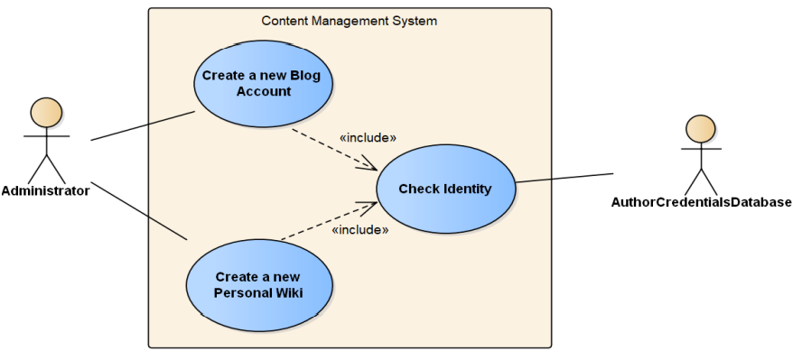
- 在用例描述中对`<<include>>`关系的表述
  - 从 Create a new Blog Account 和 Create new Personal Wiki 用例的描述中删除冗余的步骤
  - 增加一个Included Cases 栏，指出所包含的用例名
  - 用`include::<use case name>`语法指出在哪一步包含了新用例
  - 例：上述三个用例的描述

    
    
    


## 用例泛化和特化
- 一个用例的行为可能适用于几种不同的情况，但是有很小的变化
  - 不是`<<include>>`关系
  - 以面向对象的术语来说，是一个一般化（泛化）的用例有几种特殊化（特化）的情况
- 例如
  - 如果给CMS增加了支持创建几种不同类型blog账户的功能，那么创建每个账户的行为和原始的用例有些什么差别呢？
  - 在Create a new Blog Account用例中描述创建blog账户的一般行为，然后定义各种特化的用例，修改原始用例，来分别描述创建特定类型账户的行为
- 泛化关系也可以用术语“继承”来描述
  - Use case继承可以用来表示一个用例是另一个用例的一种特殊类型
- 表示法：泛化箭头
  - 例如：下面的图中给出了扩展后的CMS的用例，可以创建不同的blog账户
    - regular account
    - editorial account

  
- Create a new Editorial Blog Account 特化用例的描述
  - Create a new Blog Account 用例的大多数行为被复用
  - 只需要添加特定于创建一个editorial账户的行为
  - 用例描述如下

    
    
- 通过用例继承可以复用用例
  - 只需要说明特化用例中需要的额外步骤
  - 一般用例中的每个步骤必须在特化用例中出现
  - 一般用例与外部参与者或其他用例之间的关系对特化的用例也适用
- 如果不希望特化用例做一般用例描述的每一件事情，不要使用泛化
  - 可以考虑使用`<<include>>`关系或者`<<extend>>`关系
  - 抽象用例


## `<<extend>>`
- UML规范中的<<extend>>关系
  - A relationship from an extending use case to an extended use case that specifies how and when the behavior defined in the extending use case can be inserted into the behavior defined in the extended use case.
  - 用来表示一个用例可能完全复用另一个用例的行为，但是，这种复用是可选的，依赖于运行时或系统实现时的判定

  
- CMS example
  - 如果Create a new Blog Account 用例希望在作者创建新账户的申请被拒绝时将这个信息记录在作者的申请历史中
  - 可以在 Create a new Blog Account用例的描述中增加步骤来描述这个可选行为，如下表中的Step 4.3
  - Step 4.3的行为还可用于 Create a new Personal Wiki 用例的执行中
- `<<extend>>`关系适合描述这种复用
  - 根据需求，这种可复用的行为在两个用例中都是可选的，在请求被接受时不需要记录


## 用例关系小结


## 用例图
- 用例图显示一组用例和参与者以及它们之间的关系
  - 主体（subject）
  - 用例
  - 参与者
  - 关系：关联；泛化，include（依赖），extend（依赖）
- 建模用途
  - 对系统的上下文建模
  - 对系统的需求建模


## 对系统的上下文建模
- 识别系统的边界，即定义主体
  - 确定哪些行为是系统的一部分以及哪些行为由外部实体执行
- 识别系统的参与者
  - 考虑哪些组需要系统的帮助来执行他们的仸务，需要哪些组来执行系统的功能，哪些组与外部硬件或其他软件系统交互，哪些组执行辅助管理功能和维护。
  - 组织参与者，用泛化/特化的层次结构组织相似的参与者
  - 为参与者提供构造型，增强可理解性
  - 将参与者填入用例图，并指定从每个参与者到系统用例的通信路径
- 例：信用卡验证系统的上下文
  - 重点是系统周边的参与者
  - 发现有两种客户，个人客户和企业客户
    - 这些参与者是人类在与系统交互时扮演的角色
  - 还有代表其他机构的参与者，例如
    - 零售机构，客户与之进行卡交易以购买物品或服务
    - 金融机构，充当信用卡账户的票据交换所
    - 在现实世界中，这两个参与者本身可能是软件系统


## 对系统的需求建模
- 对系统的需求建模
  - 通过识别系统的参与者建立系统的上下文
  - 对每个参与者，考虑参与者期望或要求系统提供的行为
  - 将这些公共行为作为用例，命名
  - 将公共行为纳入其他人使用的新用例；将行为的变体纳入扩展更多主线流程的新用例
  - 在用例图中对这些用例、参与者及其关系建模
- 功能需求和非功能需求
  - 大多数系统的功能需求都可以表示为用例
  - 将非功能性需求作为注释或约束附注在用例上或整个系统上
- 例：信用卡验证系统
  - 下面的图扩展了之前的用例图。
  - 图中省略了参与者和用例之间的关系它添加了额外的用例，这些用例对普通客户来说有些不可见，但却是系统的基本行为
  - 这个图为最终用户、领域专家和开发人员提供了一个共同的起点，以可视化、指定、构建和记录他们关于该系统功能需求的决策。
    - 例如，检测卡欺诈是一种对零售机构和赞助金融机构都很重要的行为。
    - 类似地，帐户状态报告是各种机构在其上下文中要求系统执行的另一种行为。


## What's Next?
- 活动图
  - 有了用例模型，可以开始研究系统为了完成用例而必须执行的高层活动
- 类图
  - 在了解了高层活动之后，分析组成系统的类和构件
  - 对类中可能包含的内容有所了解之后，创建几个初步的类图
- 还会回到用例图吗？
  - 一旦需求有所改变，就要回来改进和精化用例，以保证正在开发的系统是用户需要的


## 小结


# U6 活动图（Activity Diagram）：对系统工作流建模
- 基本元素
- 活动和动作
- 分支和并发
- 活动图建模

## 活动图（activity diagrams）
- 用例显示了系统应该**做什么（what）**
- 活动图可以用来说明系统要**怎么做（how）**以实现其目标
  - 活动图显示了链在一起的高层动作（actions），表示系统中发生的一个过程（process）
    - 例如，可以用活动图对创建一个blog账户中包含的步骤建模
  - 活动图尤其适合对业务过程（business processes）建模
    - A business process is a set of coordinated tasks that achieve a business goal.
- 活动图是最容易理解的UML图之一
  - 使用了很多大家熟悉的表示法
    - 流程图（flowcharts），UML state diagrams，数据流图（data flow diagrams），Petri Nets
  - 活动图本质上是一个流程图，显示了从活动到活动的控制流。与传统流程图不同，活动图显示并发性以及控制分支。
- 活动图用于对系统的动态方面建模，大多用于对计算过程中的顺序或并发步骤建模


## 例：Create a new Blog Account 用例的描述


## 活动图的基本元素
- 活动图在这个例子中的作用
  - 有助于更清楚地说明用例的步骤，尤其是分支
  - 下面是活动图描述的创建blog账户过程
    - 活动图对动态行为建模，焦点是过程
  - 图中显示了活动图的基本元素
    - 活动的开始和终结节点
    - 动作和边
    - 判断、合并

  
- Initial node 
  - 起始结点，标明活动的开始
- Activity final node 
  - 活动终止结点，标明活动结束
- Actions
  - 活动中发生的重要步骤，可以是执行行为、计算、处理中的关键步骤

  
- Edges or paths
  - 边将动作连在一起决定了整个活动的流程
  - incoming edge：进入一个结点的边
  - outgoing edge：离开一个结点的边
- What's flowing along the flow?
  - 从一个动作到下一个的控制流（control flow）
  - 对象可以随控制一起在活动中流动（object flow）


## 活动和动作
- Activities and Actions
  - 动作是活动（过程）中的一步
  - 活动是被建模的过程


## 判定与合并
- 判定（decision）
  - 类似于 if-else 语句
  - 离开判断结点的边上可以标记条件（guard condition）
    - 语法格式：`[布尔表达式]`
  - 条件为真的边被执行
    - 注意条件的互斥、完备
    - 可以在一条边上标记`[else]`以保证完备
- 合并（merge）
  - 合并从判断结点出发的边，表示条件行为的结束


## 分叉与汇合（Fork and Join）
- 过程中的并行和并发动作
  - 例如：组装计算机的工作流包含下列步骤:
    1. Prepare the case（机箱）.
    2. Prepare the motherboard（主板）.
    3. Install the motherboard.
    4. Install the drives.
    5. Install the video card, sound card, and modem.
  - 其中，步骤1和2可以同时进行以节省组装时间
  - 同时发生的步骤被称为是并发或并行（concurrently or in parallel）
- 并行动作在活动图中fork（分叉）和 join（汇合）表示
  
- 在fork之后，流程被分为多个同时发生的流程，流程上的动作同时开始执行（不一定同时结束）
  - 例如 Prepare Case 和 Prepare Motherboard同时开始执行
- Join的含义是所有进入的动作都必须完成之后，流程才能离开join节点
  - Install Motherboard 只能在Prepare Case 和 Prepare Motherboard动作都结束后才可以执行


## 组装计算机工作流的完整活动图


## 时间事件（Time event）
- 时间有时是活动图的一个要素
  - 等待一段时间后进行某个动作，例如三天后发出账单
  - 一个过程在固定的时间间隔开始，例如每过一星期系统备份一次
- 时间事件用沙漏符号表示
  
- 有进入边的时间事件
  - 时间事件激活一次，因而其后的动作只发生一次
  - 文本Wait 3 Days，表示等待的时间量

  
- 没有进入边的时间事件是 recurring time event
  - 时间事件以沙漏旁边文本所标示的时间频率被激活
    - 图中的进度条每秒更新一次
  - 对重复时间事件建模

  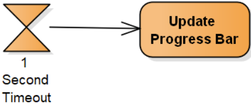
- 时间事件也可以开始一个活动
  - 图中没有开始结点
  - 可以用来对周期性发起的活动建模


## 调用活动结点
- 调用其他活动
  - 避免在一个图中出现过多的细节，提高图的可读性
  - 将动作在一个活动图中给出，更高层的活动图中可以调用该活动
  - 用于复杂动作的分解
- Call activity node 调用对应结点名字的活动
  - 用一个带叉子标志的动作表示
  - 被调用的活动最好不要省略activity frame，因为要给出活动的名字以便调用


## 对象
- 数据对象有时候是过程的重要方面
  - 例如过程处理的表单、订单、文件等
- 活动图提供了几种对过程中的数据对象建模的方法
  - Object node（对象结点）
  - Pin（别针、大头针）
  - Transformation（转换）
  - 对象状态变化
  - 注意：objects 不一定是 software objects


## 对象结点（Object Nodes）
- 对象结点表示数据在活动中流动
  - 表示一个对象在活动中的某个特定点是可用的
  - 强调该对象是活动中的重要数据，并显示与之交互的动作
  - 可以用于表示对象被周围的动作使用、创建、修改
- 对象结点的表示法
  - Order对象从 Receive Order Request 动作流向Approve Payment 动作

  


## 对象在动作之间传递
- 完整的活动图


## 动作的输入和输出
- Pins（别针，大头针）说明一个对象是动作的输入或输出
  - input pin：指定的对象是动作的输入
  - output pin：指定的对象是动作的输出
- Pin强调一个对象是动作需要的输入或输出，而对象结点则强调活动中的数据流
  


## Transformation
- 用途
  - 如果一个动作只需要某个对象的一部分，而不是整个对象，可以使用 transformation 来表示所需要的部分
  - 可以用来表示一个动作输出为另一个动作提供输入


## 对象状态
- 可以说明对象在活动中流动时的状态变化
  - 状态用`[状态]`表示
  - 例如，下图的焦点是Order对象在整个过程中的状态变化
    


## 活动输入和输出
- 对象结点可以用来强调一个活动的输入和输出
  - 活动输入输出用活动边框上的对象结点表示
    - 例如，下图表示Order对象是Approve Payment 活动的输入和输出
  - 这种表示法强调一个活动需要输入并提供输出
    - 这时可以省略活动的起始结点和结束结点

  


## 发送和接收信号
- 信号（signal）
  - 活动可能与外部的人、系统或过程交互
  - 在活动图中，用信号表示与外部参与者的交互
- 信号是可以被发送和接收的消息
  - 例如，某软件向信用卡公司发送一个批准信用卡事务的请求，该软件收到信用卡公司的响应；从信用卡批准活动的角度看，有发送信号和接收信号
  - 例如，系统通知顾客其送货被延迟，从订单送货活动的角度看，是发送信号
- 接收信号（Receive signal）
  - 是接收到的来自一个外部过程的信号
  - 可以激起活动图中的一个动作
  - 信号的接收者知道如何对信号作出反应，并预期信号到达，只是不知道何时
- 发送信号（Send signal）
  - 是发送给某个外部参与者（participant）的信号
  - 当外部的人或系统收到这个消息时，他/它可能做某些事情进行响应，但是这不在本活动图中建模
- 发送信号结点和接收信号结点表示与外部参与者（participants）的交互
  
- 接收信号结点
  - 有进入边：只是在上一个动作完成时才开始等待信号到达
  - 没有进入边：该节点在所处的活动激活时总是等待一个信号的到达
    - 可以作为一个活动的开始节点，如下图：每当接收到一个信号时活动就起动

  


## 活动的开始和结束
- 开始活动的几种方式
  - 最简单常用的方法：起始结点
  - 收到输入数据（对象结点）
  - 响应时间事件
  - 由信号激起

  
- 活动的结束和流程的结束
  - 实际的业务过程建模中可能遇到复杂的流程结束情况，活动图提供了两种结束结点
  - Activity final node
  - Flow final node

  


## 活动结束
- Activity final node（活动终止结点）
  - 例如，下图中只有一条到活动终止节点的路径，活动中的每个动作都可以完成

  
- 一个活动图中也可以有多个活动终止结点
  - 当流程到达活动终止结点时，活动中的所有其他动作都终止，包括终止结点之前的动作
  - 不清晰

  
- 在fork节点后使用活动结束时要注意
  - 如果希望所有分叉的动作都可以执行完成，要加join节点

  


## 结束流程（flow）
- Flow final node
  - 流程终止结点结束自己的路径，而不是结束整个活动
  - 例如，右图中，当2秒时限到时，返回搜索结果，整个活动结束，包括 Improve Search Results 动作
  - 如果2秒之内 Improve Search Results 结束了，它不会终止整个活动

  


## 活动结束vs.流程结束


## 中断活动
- 如何表示过程被某个事件中断？
  - 例如，一个长时间运行的过程被用户提前终止，订单处理活动中订单被取消
- Interruption regions
  - 表示法：虚线圆角矩形
  - 中断区域中包围的动作可以被中断事件终止
- 中断区域只与其中包含的动作有关
  - 如果是在Process Order 动作激活时接收到取消信号，那么 Process Order 会被中断，控制转到 Cancel Order 动作
  - 如果是在 Ship Order 激活时收到取消信号，Ship Order 不会被中断，因为它不在该区域

  


## Partition (Swimlane)
- 活动有时会涉及不同的参与者（participants）
  - 例如，订单处理活动需要多个参与者
    - 需要 shipping department 送货， accounts department 给顾客发出账单
  - 例如，技术支持过程
    - 需要不同级别的支持，包括 1st level Support, Advanced Support, 和Product Engineering
- 分区 partitions 可以用来显示哪个参与者负责哪些动作
  - 分区将活动图分为多个行或列，每行或列包含由负责组执行的动作
  - 这里的行或列也被称为泳道 swimlanes
- 也可以用annotations（注解）表示责任


## 复杂的活动图
- UML 2.0 提供了捕捉复杂行为的建模表示法
  - 在活动图中有其他很多符号可以对各种过程建模，例如：
    - Connectors
    - Expansion region
    - Exception handling
    - Data store node
    - Central buffer node
    - Looping/Streaming


## Connectors
- 连接器可以提高包含很多动作的活动图的可读性
  


## 异常处理


## 活动图建模
- 对工作流建模
  - 业务流程

  
- 对操作建模
  - 流程图

    
  - 对应的源代码

    ```java
    Point intersection(line : Line) {
        if (slope == line.slope)
            return new Point(0, 0);
        int x = (line.delta - delta) / (slope - line.slope);
        int y = (slope * x) + delta;
        return new Point(x, y);
    }
    ```


## What's Next?
- 对系统动态行为建模的其他图
  - Sequence diagrams（序列图）
  - Communication diagrams（通讯图）
  - 这些图主要说明详细的交互细节，比如哪些对象参与了交互，哪些方法被调用了，事件的顺序等
- 状态机图
  - UML2的状态机图和活动图共用一些概念和表示法


## 小结


# U7 交互图（Interaction Diagrams）
- Sequence Diagram
- Communication Diagram
- Timing Diagram
- Interaction Overview

## 交互建模
- 面向对象的系统中，对象通过传递消息相互交互
- 交互（interaction）
  - An interaction is a **behavior** that comprises **a set of messages exchanged among a set of objects** within a **context** to accomplish a purpose.
- 通过交互对协作的动态方面建模
  - 扮演特定角色的一组对象，一起工作以执行一些行为，达成目的
  - 这些角色代表类、接口、组件、节点和用例的**原型实例**
- 交互图对系统组成部分之间运行时的重要交互建模
  - 系统的逻辑视图、动态视图、交互视图、行为模型
- UML 2的交互图
  - Sequence diagrams，顺序图，序列图
  - Communication diagrams，通信图，通讯图（UML1.X的协作图）
  - Timing diagrams，定时图，时序图
  - Interaction overview diagrams，交互概览图
  - 这些图帮助我们准确地对系统组成部分之间的交互建模


## 序列图（Sequence Diagrams）：Modeling Ordered Interactions
- 序列图是交互图中最常用的一种
  - 序列图着重捕捉系统中各部分之间交互的顺序（order）
  - 使用序列图可以描述在一个特定用例执行时会激发哪些交互、这些交互以什么次序发生
- 序列图的基本元素
  - 角色，也叫做对象、参与者
  - 消息
  - 控制结构


## 交互的参与者
- 序列图的交互参与者
  - role，object，participant
  - 参与者对象是系统的组成部分，它们之间彼此交互
  - 序列图中，对象水平排列，不能重叠
  - 每个参与者对象有一条生命线（lifeline）

  


## 对象命名
  - 序列图上的对象可以以多种方式命名，标准格式如下:
    `name [selector] : class_name ref decomposition`
  - 也可以使用角色名，名字的格式为： `/rolename : class_name`
    


## 时间
- 序列图描述交互发生的次序，因而时间是一个重要因素
  - 时间从图顶部沿生命线向下，表示进度
  - 序列图上的时间只表示时序（先后、早晚），不表示时间段（时间长短）

  


## 事件、信号和消息
- 事件（event）
  - 事件是一个交互中的一点，在这个点上发生了某事
  - 事件是消息（message）和信号（signal）的构造块
- 信号和消息是同一个概念的不同名字
  - 信号是系统设计者常用的术语，而软件设计者常用消息
  - 在序列图中，信号和消息相同
- 序列图中消息的类型
  - 同步消息（调用）；异步消息、异步调用
  - 返回消息、构造消息、销毁消息等


## 消息
- 序列图中的交互始于一个对象决定向另一个对象发送一个消息
  - 序列图上交互被表示为对象（生命线）之间的消息传递

  
- 消息的表示
  - 序列图中用从一个对象（发送者）到另一个对象（接收者）的箭头表示
    - Message Caller
    - Message Receiver
  - 消息的方向
    - 对交互有意义的仸何方向：向左、向右、到对象自身

  
- Message Signatures
  - 消息箭头上标注有其描述，即signature
  - message signature 的格式
    ```
    attribute =
      signal_or_message_name
      (arguments) : return_type
    ```
    - 参数（argument）的格式 `<name>:<class>`

  


## 执行规约（Execution specification）
- 执行规约
  - 在UML1.X中称为activation（激活）
  - 在交互中执行活动、操作或其他行为单元的规范。
  - 执行（有时称为控制焦点）表示对象直接或通过从属行为执行行为的时间段。
  - 它对执行的持续时间以及执行与其调用者之间的控制关系建模。
  - 在传统的计算机和语言中，执行本身对应于堆栈帧的值（活动记录）。


## Activation（激活）
- 激活
  - 当消息被传递给参与者时，它激发或引发该参与者去做某件事情
  - 此时，接收消息的参与者被激活（active）
- 激活条（activation bar）表示参与者处于激活状态
  - 该参与者在这段时间忙着做某事（处理消息）
  - 消息的发送端和接收端都可以显示激活条
    - 如下图所示（Execution specification（Activation Bars））
      
  - 激活条是可选的


## 嵌套消息
- 嵌套消息
  - 如果来自某个对象的消息导致消息接受者发送出一个或多个消息，那么这些被引发的消息称为触发消息的嵌套消息
  - initialMessage引发了两个嵌套消息


## 消息箭头
- 消息箭头表明消息的类型
  - 序列图中有5种主要的消息箭头，各自含义不同


## Message notation in sequence diagram


## 同步消息
- 调用一个同步消息时，消息发送者要等待消息接受者返回
- 返回消息是可选的
  - 同步消息隐含有返回，可以不必画出
  - 如果有，则从激活条的末尾返回，表示控制返回给调用者


## 异步消息
- 异步消息被调用时，消息发送者不等待其返回，继续自己的其他交互
  - 当 messageReceiver 对象处理 foo( ) 消息时，messageCaller 对象不等待其返回，而是可以在另一个对象上执行其他的同步消息继续交互

  


## 创建和销毁
- 对象创建和销毁消息
  - 有些参与者对象不是在序列图所描述的交互过程中一直都存在
  - 可以根据传递的消息来创建和销毁参与者
- 创建的两种表示
  - 向对象生命线传递一个create(..) 消息或构造方法调用消息
  - 比其他对象在图中的位置低一些，将`<<create>>`消息发送给对象
- 销毁的两种表示
  - 发送`<<destroy>>`消息，在要被销毁的参与者的生命线上画一个“X”
  - 只在生命线上画“X”（如java语言中没有析构函数）


## 用例实现（realization）
- 通过序列图可以实现执行用例所需的交互
  - 例如， Create a new Regular Blog Account 用例的实现

  
- 从用例描述的Main Flow中抽出构造序列图所需的信息
  - 包含了继承的父用例步骤，但没有考虑分支的情况

  

  


## 细化序列图
- 加入更多的交互细节，将交互分解到不同的对象
  - 上面的序列图只显示了外部actor和系统的交互
  - CMS系统在上图中由单独一个对象表示，但实现时不会如此
    - 比如，至少UI的功能会分离出来
  - 细化的序列图如下页所示
- 每增加一个参与者对象，序列图就会更复杂
  
- 对象创建
  - 用例Create a new Regular Blog Account, 实际创建的blog账户在序列图中的表示
  - 创建账户时使用的作者信息author details也不是一开始就存在的
- 对象删除
  - authorDetails:AuthorDetails 对象在创建了新账户之后就不再需要，将其删除

  
- 应用异步消息
  - Administrator 发送了clickSubmit( ) 消息之后不需要等待返回
  - 可以用异步消息建模
  - 将 clickSubmit() 从同步消息转换为异步消息意味着序列图现在显示，当提交新的常规博客账户信息时，用户界面不会锁定并等待新账户的创建，而是允许管理员角色继续使用系统。
  - 为了让管理员接收关于新博客账户是否已创建的反馈，返回消息箭头替换为新的 accountCreationNotification() 异步消息，因为异步消息clickSubmit()没有返回值。

  


## 组合片段（Combined Fragments）
- 序列图中显示的消息序列是顺序控制流
  - 条件分支，循环，并发等控制怎么表示呢？
  - 控制结构
- 组合片段可以用来组织和管理复杂的交互
  - 使用组合片段可以显示更复杂的控制流程
  - 使用片段可以使序列图的创建和维护更容易
  - 可以混合使用各种类型的片段，准确地建模
- 表示法
  - 组合片段具有关键字和一个或多个子片段（称为交互操作数）， 子片段的数量和含义取决于关键字。
  - fragment box
  - fragment operator

  
- alt
  - 关键字alt表示条件片段
  - 条件片段有两个或多个子片段，每个子片段都有一个guard condition
  - 到达条件片段时，执行guard condition为真的子片段

  
- loop
  - 循环片段
  - 循环有一个子片段，只要子片段中的第一个guard condition为真，就会执行该子片段
  - 参数
    ```
    loop(min times,max times)
    [guard_condition]
    ```
  
- par
  - 并行片段
  - 并行片段有两个或多个子片段；当到达片段时，所有子片段同时执行。
  - 不同子片段中消息的相对顺序是不确定的，消息可以以仸何可能的顺序交错。
  - 当所有子片段都完成执行后，并发执行再次合并为一个流。

  
- opt
  - operator opt 的意思是可选的片段
  - 根据片段上的guard condition 来决定是否执行该片段中包含的交互

  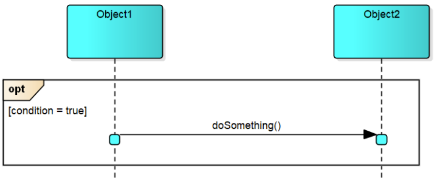

  
- ref
  - 引用一个已定义的交互
  - 交互使用是对另一个交互的引用，通常在它自己的序列图中定义。

  

  
- 被引用的交互
  


## 其他操作符
- assert
  - 片段中包含的交互必须完全按照指示发生；否则该片段被声明为无效，并应引发异常。在指定交互中的每一步都必须成功发生时很有用，例如对事务建模。
- neg
  - 声明永进不执行此片段内的交互；其工作方式类似于在代码中注释掉某些方法调用。
- break
  - 如果片段中包含的交互发生，则应退出仸何封闭的交互，最常见的是循环片段；类似于break 语句。
- region
  - 此类片段内的交互被称为关键区域的一部分。关键区域通常是共享参与者更新的区域；与 Java 中的同步块和对象锁有相似之处。


## What's Next?
- Communication diagrams 通讯图
  - 从不同的角度描述交互
  - 可以和序列图相互转换
- Timing diagrams 时序图
  - 显示交互中的时间约束，对实时系统尤其有用
- Interaction Overview
  - 交互概图从更大的角度对系统中发生的交互建模


## 通讯图（Communication Diagram）：Focusing on Interaction Links
- 序列图着重说明交互时事件发生的次序
  - 序列图中，参与者对象之间的链接是隐含的
- 通讯图更长于表现对象之间要传递交互的消息时需要哪些链接
  - 通讯图中，交互中事件的次序则是不重要的信息
- 通讯图中包括
  - object，参与交互的对象
  - communication links，对象之间的通讯链
  - messages，沿着通讯链传递的消息


## 基本元素


## 对象/角色
- 表示法
  - 对象用一个矩形表示
    - 名字和类在矩形中
  - 对象名字的格式 `<name> : <class>`
    - 可以指定两个、也可以只指定其中一个、或不指定（匿名对象）
  - 角色名格式 `</rolename> : <class>`


## 通讯链
- 表示法
  - 通讯链由连接两个对象的线表示，如图
  - 链的作用是允许消息在不同的对象之间传递


## 消息
- 表示法
  - 用一个实心箭头表示，如图
  - 箭头上标注消息的signature（名字、参数表）
  - 如果想要说明在交互期间消息调用的次序，可以用数字标记

  
- 通讯图上的消息使用数字编号来表示次序
  - 编号从1开始，逐一增加
  - 表示嵌套消息的分级编号方法
    - 如图，1.1和1.2是消息1的嵌套消息
      
- 同时发生的消息
  - 同时被调用的消息用数字-字母法表示
  - 如图，消息 2a.messageB(), 2b.messageB(), 和 2c.messageC() 是在调用了 1.messageA()之后同时被调用的
    
- 根据条件发送消息
  - 可以设置监视条件（guard condition）描述只有在特定条件为true时才调用某个消息
    - 条件为真时调用消息，否则消息被略过

  
- 多次调用的消息
  - 描述循环的消息可以使用星号（*）
    - 例如，表示发生10次的循环约束 `*[i = 0 .. 9]`

  
- 对象发送给自己的消息
  - 对象可以给自己发消息
  - 需要有一个对象到自身的链接

  


## 用通讯图描述交互
- CMS中创建blog账户的序列图
  
- 第一步：确定参与者，并将其加入通讯图
  - 这个例子中可以从序列图获得参与者对象
  - 如果没有序列图，通过用例描述获得
  - 有些UML建模工具支持由序列图转换得到通讯图

  
- 第二步：加入对象之间的链接
  
- 第三步：添加对象之间发送的消息
  - 最好从发起交互的对象开始

  
- 添加对象之间发送的消息
  - 根据序列图依次添加后续的消息
    - 消息的编号

  


## 通讯图 vs 序列图
- 通讯图和序列图呈现了类似的信息
  - 语义等价
  - 通讯图和序列图都显示交互，但它们强调不同的方面。
  - 序列图清楚地显示了时间序列，但没有明确地显示对象关系。
  - 通讯图清楚地显示了对象关系，但时间序列必须从序列号中获得。
  - 序列图通常最适用于显示场景；通讯图对于显示程序的详细设计通常更有用。
  - 然而，一旦定义了过程的结构，序列图对于规划精细的控制细节可能更有用。
- 选择哪一个来对交互建模？
  - 根据个人喜好
  - 通讯图：显示参与者对象及其链接
  - 序列图：消息的时序和消息流的可读性，控制结构
- 根据比较的结果
  - 如果关注一个特定交互中的消息流，使用序列图
  - 如果关注交互的参与者之间的链接，使用通讯图
  - 时间允许的话，两种都使用


## What's Next?
- 序列图和通讯图是最常用的两种交互图
  - 根据用例描述，实现用例
  - 根据序列图和通讯图细化分析类图
    - 分析类，关联，操作
- Timing diagrams
  - 注重交互中的时间约束
  - 在实时系统建模中尤其有用


## 时序图（Timing Diagrams）：Focusing on Interaction Timing
- 时序图，计时图，时间图
  - Timing diagrams are all about timing.
  - Timing
    - 定`[较，计]`时；同步，时限；时间选择；调速；定时方法，同步技术
    - 定时(时机的选择,安排时间)
  - 显示序列图的另一种方式，它明确显示生命线和度量时间（时间单位）上的状态变化。
  - 在实时应用程序或嵌入式中可能很有用，但不限于这些领域
    - 如果交互模型的时间信息比较重要时，也可以使用；例如，一个交互必须在10秒内完成，一个消息应该在交互总时间的一半之内返回

  
- 和序列图表示法的区别
  - 轴的时间从左到右增加
  - 生命线显示在垂直排列的单独隑间中
  - 生命线上下缓慢移动以显示状态变化。每个垂直位置代表不同的状态。状态的排序可能有也可能没有仸何意义。
  - 生命线也可以在同一行，该行上显示不同的状态或值
  - 可以显示度量时间轴。 刻度线表示时间间隑，有时是发生变化的离散时间。
  - 不同生命线上的时间是同步的。
  - 可以显示对象持有的值。
- 在时序图中，各事件都有相关的时间信息，能够准确描述
  - 事件什么时候被触发
  - 另一个对象要花多长事件接受该事件
  - 接受对象会处于某个特定状态多长时间
- 时序图与电子线路板分析中的图很类似
  - 消息、事件、信号
  - 参与者对象，生命线
  - 状态、条件
  - 时间


## 基本元素


## 构造时序图
- 例：从序列图出发构造时序图
  - Create a new Regular Blog Account 交互
  - 序列图如下页所示
    - 在序列图中包含的时间信息很少，其焦点是一个交互中的事件顺序
  - 修改系统需求，增加时间约束
  - Requirement A.2 (Updated)
    - The content management system shall allow an administrator to create a new regular blog account within five seconds of the information being entered, provided the personal details of the author are verified using the Author Credentials Database


## 参与者对象
- 在时序图中使用参与者
  - 将交互中的所有参与者对象列在时序图上
    - 交互中涉及的主要对象的名字在时序图左边列出（垂直方向）`<name>:<type>`
  - 图中没有对象的创建和销毁信息
    - 时序图关注与时间相关的状态变化


## States 状态
- 在交互期间，对象可以处于多个状态
  - 当对象接收一个事件时（比如消息），可以说参与者处于一个特定的状态；
  - 对象在另一个事件（比如消息返回）发生之前将一直处于该状态
  - 在时序图上，状态放在相应的参与者旁，水平排列

  


## 时间
- 时序图上的时间从左向右
  - 在图底部用刻度尺表示
- 两种表达时间度量的方式
  - Exact Time Measurements 确切时间度量
  - Relative Time Indicators 相对时间指示器

  
- 时序图中的 t
  - t 表示我们感兴趣的一个时间点
  - 我们不知道它实际是哪一刻发生（比如响应消息或事件），但可以用 t 表示出来
  - 可以用 t 作为参考时间点，说明相对于该点的时间约束
- 时间约束是准确时间和相对时间的混合
  - 例如，Requirement A.2中的时间约束
    - 图中起始时间用秒度量，所以一个 t 表示一秒

  


## 对象的状态线
- 状态线（state-line）
  - 可以显示在仸何给定时间点对象所处的状态
  - 对象当前的状态用一条水平线表示，状态线
  - 交互中的仸何给定时间点，对象的状态线与该对象的一个状态对齐

  


## 事件和消息
- 在时序图中，对象改变状态来响应事件
  - 事件可以是调用消息或其他，比如消息返回
  - 消息和事件的区别在时序图中不是非常重要
  - 重要的是，无论什么事件，在时序图上都表示为触发一个对象的状态变化
- 事件的表示法
  - 从一个对象状态线（event source）到另一对象状态线（event receiver）的箭头
  - 事件自己也可以有持续时间
  - event1 从调用到接收用了一个单位时间
  - p1:Participant1 调用，p2:Participant2接收

  
- 在实际应用中，可以向时序图中同时加入事件和状态
- 根据序列图向时序图中添加事件比较简单
  - 序列图已经显示了对象之间传递的消息
  - 例如下图

  


## 时间约束
- 时间约束（timing constraint）是时序图建模最重要的信息
  - 对象、状态、时间、事件和消息都是对时间约束建模的背景
- 时间约束详细描述交互的一个给定部分要用多长时间
  - 例如，对象处于特定状态的时间总量，调用和接收一个事件应该花费的时间
  - 时间约束可以与一个事件或一个状态关联
  - 时间约束可以带或不带约束边界箭头


## 时间约束的格式


## 时间约束
- 给状态和事件添加时间约束
  - 例，Requirement A.2的时间约束
  - 在图中，5 seconds per new regular blog account creation 的时间约束没有直接表示出来
  - 该约束涉及参与者之间的多个不同的嵌套交互
  - 需要建模者的技巧：决定给哪些事件或状态如何分配这5秒钟，以便每个参与者能够做自己的工作

  


## 组织时序图
- 组织时序图上的对象
  - 随着事件和时间信息的加入，如果发现对象的位置布局不合理，可以进行调整
  - 如下图
    
- 
- 如果已经有序列图，可以在一开始安排好对象的位置
  - 根据对象在序列图中的位置，逆时针旋转90度
    


## 时序图的另一种表示法
- 当包含状态数目比较多时，可以使用简化的记号
  - 对象和时间的表示法同前，状态和状态改变用不同的方法表示
  - 例如，下面是常规的时序图表示法
    
- 时序图的另一种表示法（紧凑表示）
  
- 常规时序图表示法（状态时间线）
  - 状态在相关对象旁列出
  - 用状态线表示对象在给定时间处于什么状态
  - 对象的状态多时，需要空间大
- 紧凑的表示法（数值时间线）
  - 没有不同状态的垂直列表
  - 对象的状态直接放在对象处于该状态的时间点
  - 不需要状态线，一个对象的所有状态可以放在一条线上
  - 显示对象状态改变时，在两个状态间画一个交叉，引起状态变化的事件写在交叉旁
  - 时间约束与常规表示法相同
- 使用哪种表示法？
  - 如果对象在整个交互过程中有多个不同状态，可以使用紧凑表示法
  - 否则使用常规表示法，因为其使用更广泛


## An Alternate Notation


## What's Next?
- Timing diagrams
  - 对象状态的概念在时序图中是不可缺少的
  - 时序图显示一个对象在特定时间的状态
- State machine diagrams
  - 状态机图详细描述一个对象状态和引起状态改变的触发器
- 这两种图对于实时系统和嵌入式系统建模都很重要


## 交互概览图（Interaction Overview Diagrams）：Completing the Interaction Picture
- Interaction Overview
  - 活动图的一种变体，将交互图片段与控制结构流结合在一起
- 表示法
  - 结点：序列图、通讯图符号，主要是引用、嵌套的交互图片段，来自活动图的决策和分叉符号
  - 边是控制流符号，显示嵌套交互片段之间的高级控制流
- 一个大学录取的学生例子
  - 首先，学生必须接受或拒绝录取
  - 接受后，学生必须同时注册课程和申请住宿
  - 在这两项都完成后，学生必须付款。 如果没有及时收到付款，该学生将被拒绝。

  
- 交互概览图
  - 看起来像是一个活动图，不过其中的动作是交互
  - 可以将交互概图中的每个部分当作是一个完整的交互
  - 每个交互有自己的图
    - 如果概览图中的一个交互最关注时间，就用时序图
    - 如果一个交互关注消息次序，就用序列图
  - 交互概览图将这些分离的交互粘结在一起
- 交互概览图的目的是为了提供系统交互的全局视角
  - 交互概图提供了一个更高层次的视图，了解几个交互如何一起工作以实现一个系统的关注（concern），比如一个用例
  - 序列图、通讯图和时序图都聚焦于特定的细节，关注组成交互的消息
  - 交互概图将这些不同的交互连接在一起，形成一个完整的交互图，形成一个特定的系统关注点
Interaction Overview
- 参与者对象
  - 交互中涉及的对象也可以出现在交互概图中
  - 在图的标题上加一个lifelines 子标题
    - 显示了所有交互的参与者对象列表

  
- 开始和结束
  - 交互概览图从起始节点开始，到终止节点结束
- 控制流
  - 控制流通过起始节点和终止节点之间的交互
  - 如同在活动图中一样，除了顺序流，还可以使用判断、并行、循环等控制流
- 用交互概览图对用例建模
  - 例子： Create a New Regular Blog 用例
  - 在交互概览图中，可以选择不同的交互图类型，每部分的交互可以用最适合的技术建模
- 第一步：确定将交互概览如何分解为最适合各个交互的图
  - 在此例子中使用了三种交互图
    - sd 序列图
    - cd 通讯图
    - td 时序图

  
- 在对 Select Blog Account Type, Create Regular Blog Account, 和 Tidy Up Author Details 交互建模时，消息的次序是最重要的因素，所以使用序列图对它们建模
  - 用序列图建模的一些交互

  

  
- Enter Author Details 交互则用通讯图建模
  - Enter Author Details 交互的通讯图

  
- Check Author Details 交互使用时序图建模
  - 显示关键时间约束的时序图

  
- 添加交互参与者对象
  - 在标题下列出参与者

  
- 最后一步，将这些交互粘结在一起
  - 添加控制流，控制流表明了各个交互的执行顺序

  


## What's Next?
- 交互概图是各种交互图的粘结
  - sequence diagrams
  - communication diagrams
  - timing diagrams
- 显示更高层的视图


## 小结


# U8 状态机（State Machine）图：对象生命周期的状态变化和行为
- 状态和转移
- 事件、条件、动作
- 组合状态
- 状态机建模

## Overview
- 状态机
  - 状态机是一种行为，指定对象在其生命周期中响应事件所经历的状态序列，以及它对这些事件的响应。
- 状态机是一个类的对象的所有可能的生命历史的模型
  - 对象被看作是一个孤立的实体
  - 来自世界其他地方的仸何外部影响都被概括为一个事件
  - 当对象检测到事件时，它会根据自己当前的状态作出响应
    - 响应可以包括效果的执行和对新状态的改变
  - 状态机描述一个对象可能持有的状态，对每个状态，状态机指定接收每种事件的后果
- 事件
  - 事件代表一个对象可以检测到的变化类型
    - 一个对象到另一个对象的调用；
    - 显式信号的接收；
    - 某些值的变化；
    - 时间的流逝
  - 仸何可以影响对象的事物都可以被描述为事件
- 状态
  - 给定类的一组对象值，对发生的事件具有相同的定性响应。
  - 具有相同状态的所有对象都以相同的一般方式对事件做出反应，因此处于给定状态的所有对象在接收到相同事件时都会执行相同的效果——动作或活动。
  - 处于不同状态的对象可能会通过执行不同的效果对同一事件做出不同的反应。


## 状态机（State machine）建模
- 状态机图
  - 描述类的实例对它在生存期期间可能检测到的事件的响应
  - 也可以描述用例、协作和方法的执行
  - 对于理解控制机制很有用，例如用户界面和设备控制器。
  - 是对象的局部视图，是将对象与世界其他部分分开并孤立地检查其行为的视图
  - 是精确指定行为的好方法，但通常不是理解系统整体操作的好方法。
  - 为了更好地了解行为对系统范围的影响，交互视图通常更有用。
- 状态图和交互图
  - 交互图和状态机给出的是系统动态行为的两个互补的视图。
  - 使用交互，可以对协同工作的一组对象的行为建模
    - 交互图显示了在较短的一段时间内在系统中的对象之间传递的消息，通常是在单个用户产生的事务期间，因此这些图必需描述很多对象，即特定事务中所涉及的那些对象。
  - 使用状态机，可以对单个对象的行为建模
    - 而状态图自始至终在一个对象的整个生存期中跟踪该对象，指定该对象能够接收的所有可能的消息序列以及它对这些消息的响应


## 依赖状态的行为
- 许多对象展现出了依赖状态的行为
  - 这意味着对象在不同时间会对相同的刺激做出不同的响应
  - 例如，ATM机的“取消”按钮，在处理业务的过程中按下，和在空闲状态下按下，ATM会有不同的响应
  - 例如，CD Player的“play”按钮，当CD机里面有碟片时，会播放曲目，而没有碟片时不会播放。
- 区分状态的基本原则
  - 对象处于一个特定的状态时，对至少一个事件的响应和对象处于其他状态时对该事件的响应不同


## 状态
- 对象的状态和行为状态
  - 对象的状态被定义为在给定时间其属性的值的整体；属性值区分
  - 行为状态则通过处于不同状态的对象对事件的响应不同来区分
- 行为状态的特性
  - 一个对象有若干个可能的状态，并且在仸何给定时间恰好处于这些状态中的一个
  - 对象可以改变状态，通常，它在给定时间所处的状态会由它的历史决定。
  - 在不同时间，对象可能依赖其状态对同一刺激做出不同的响应


## CD Player
- drawer
- 控制面板，上面有按钮“load”、“play”和“stop”
  - load：如果drawer关着，load按钮使之打开，如果drawer开着，则使之关闭
  - stop：如果player正在播放则停止；如果没有正在播放CD，按下stop按钮不起作用
  - play按钮播放CD


## 状态、事件和转移
- 要构造对象的状态图，必须首先初步确定对象能够处于什么状态以及它能够检测什么事件
- 初步识别出CD Player的三个状态
  - open和closed：因为按下load按钮的不同结果可区分
  - playing：stop按钮的不同结果
- CD Player能够检测到的外部事件是按下三个按钮，事件
  - load
  - stop
  - play
- 转移（transition）
  - 检测到一个事件可能导致对象从一个状态移动到另一状态，这样的移动称为转移
- 状态图上显示的基本信息
  - 实体的可能状态以及状态之间的转移
  - 换句话说，检测各种事件的路径引起系统从一个状态转移到另一状态
- 表示法
  
- CD Player基本模型的状态图
  
  - 自转移（self-transition）
  - 激活状态（active state）
    - 给定时刻对象所处的状态
  - 触发器（trigger）
    - 引起转移被激发的事件
- 状态机是可执行的


## 初始状态和终止状态
- 初始状态（initial state）
  - 用黑色圆点表示
  - 从初始状态出发的转移表示创建或初始化对象时进入的状态
  - 从初始状态出发的转移上不应该写仸何事件
- 终止状态（final state）
  - 用大圆圈中加一个小圆点表示
  - 代表对象在响应撤销、关闭或其他终止事件时到达的状态
  - 具体含意依赖于状态图所描述的对象的特性。如果是一个软件对象（类的实例）到达终止状态，那么它将完全被销毁：如果它有析构函数，那么将调用析构函数，并回收对象占用的内存
- CD Player在开关机器时的行为
  - 假定关机时它不表现出仸何行为，开机时它总是直接到closed状态
  - 用一个新事件“off”对关播放机机建模

  


## 非确定性
- CD Player状态图的问题
  - 在closed状态按下play时，如果有碟片则播放，没有碟片不播放
  - 对这两种可能的后果建模：
    
- 这是一个非确定的状态图
  - 这个图表明play事件可以触发两个可能的转移，但并没有说明什么时候激发其中的一个转移而不是另一个


## 监护条件（Guard condition）
- 监护条件（guard condition）
  - 在状态图上，可以通过为转移增加监护条件来表明在什么情况下将激发该转移
  - 监护条件是转移的规格说明的一部分，写在标注该转移的事件名字之后，并用方括号括起来。

  
- 用监护条件区分转移
  


## 动作（action）
- 动作（action）
  - 状态图能够说明对象响应检测到的特定事件时做些什么
  - 这通过在图中的相关转移上增加动作来表明
  - 动作写在事件名字之后，前面加斜线“/”
- 动作的特点
  - 动作被看作是简短的、自包含的一段处理，所花费的完成时间可以忽略
  - 动作的定义特征是它在转移到达新状态之前完成；隐含着动作不能由对象可能检测到的仸何其他事件中断，而必须总是执行完成
- `event [guard condition] /action`
  


## 入口动作和出口动作
- 入口动作（entry/action）
  - 每当一个状态变为激活状态时，就执行入口动作，紧接在通向该状态的转移上的动作完成之后
- 自转移
  
- 出口动作（exit/action）
  - 只要离开该状态的转移激发时就会执行


## 活动
- 活动（activity）
  - 要花费时间完成的持续操作可以被表示为状态中的活动：“do/活动”
- 活动和动作的区别
  - 当状态成为激活状态时，执行入口动作后开始它的活动，在状态处于激活的整个期间该活动都持续运行
  - 动作是瞬时的，其执行不能被中断
  - 活动是发生在一段延续的时期之内；可以被激发状态转移的事件中断

  


## 完成转移
- 完成转移（completion transition）
  - 没有事件标注的转移
  - 在状态的内部活动正常终止，没有被外部事件中断时，可以触发完成转移
  - 完成转移也可以带监护条件

  


## 内部转移（internal transition）
- 问题
  - 假定CD Player有一个“info”按钮，按下时显示当前曲目剩余的时间，但是不中断正在进行的曲目播放
  - 这种事件让对象停在同一状态，不触发状态的改变以及入口与出口动作的执行，如何建模？
- 内部转移
  - 写在状态之中，标注为引起该转移的事件的名字

  


## 组合状态（composite state）
- 现有状态图
  - 混乱，难以理解，存在冗余
- 简化图的方法
  - 允许一个状态包含若干子状态
  - 子状态共享某些特性（如转移），这些特性可以被更简明地表示为一个“超状态”的特性，而组合在一起放入一个状态中

  

  
- Not Playing
  - 是由两个嵌套的子状态组成的一个组合状态
- 特性
  - 如果组合状态是激活的，那么它的子状态中只有一个必须也是激活的
  - 在对象处于组合状态时检测到的事件可以触发从组合状态本身出发的转移，或者从当前激活的子状态出发的转移
- 组合状态中的嵌套状态形成了一种“子状态图”
  - 顺序，正交
- 组合状态可以包含初始状态和终止状态
  - 组合状态中的初始状态表示，如果到达组合状态的转移终止于组合状态的边界时，该默认子状态即成为激活状态。
  - 组合状态中的终止状态表明，状态中正在进行的活动已经完成。到达终止状态使从组合状态出发的完成转移能够激发。
- 组合状态可以有自己的入口和出口动作
- CD Player的“pause”按钮
  - 假设按下“pause”按钮会引起播放被中断
  - 当再次按下这个按钮时，从暂停的位置开始继续播放
    - 和按下播放按钮的情况不同，曲目不用重新开始
- 在暂停状态按下play？
  


## 历史状态
- 历史状态
  - 由圆圈中一个大写字母“H”表示
  - 只能出现在组合状态之内
  - 到达历史状态的转移引起组合状态中最近的激活子状态再次成为激活的

  


## 默认历史状态
- 没有记忆的历史
  - 如果历史状态是组合状态的第一个激活子状态，根据定义，在这种情况下应该没有记忆的历史
  - 在这种情况下，需要指定一个默认状态成为激活的
- 从历史状态向需要的默认状态画一个无标注的转移
  


## CD Player总结


## 状态图概念和表示法小结
- 状态
  - 简单状态，组合状态
- 转移
  - 外部转移，内部转移，完成转移
  - 条件和动作
- 事件
  - 调用，信号，时间，变化
- 伪状态
  


## 简单状态


## 事件类型
- 调用事件（call event）
  - Receipt of an explicit synchronous call request by an object
  - op (a:T)
- 变化事件（change event）
  - A change in value of a Boolean expression
  - when (exp)
- 信号事件（signal event）
  - Receipt of an explicit, named, asynchronous communication among objects
  - sname (a:T)
- 时间事件（time event）
  - The arrival of an absolute time or the passage of a relative amount of time
  - after (time)


## 转移


## 组合状态：顺序子状态


## 组合状态：并发子状态


## 子状态机（submachine）
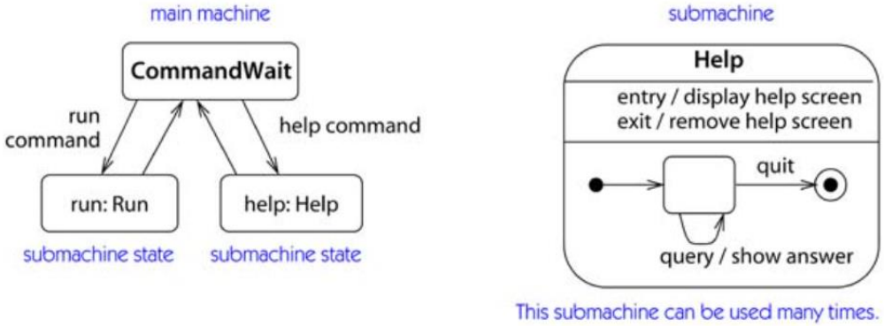


## 子状态机引用
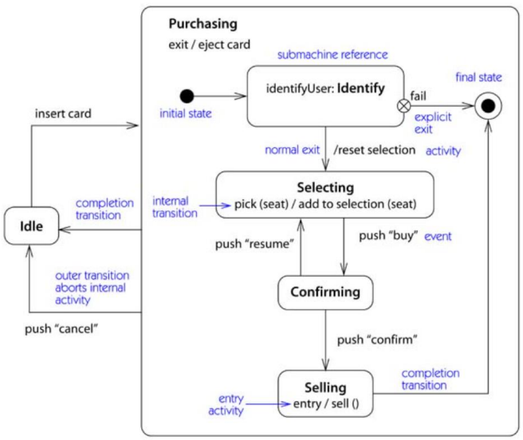


## Ticket Machine的动态建模
- 售票机简介
  - 界面上的每个按钮对应一种车票，按下按钮显示票价；机器空闲时，界面上会显示机器现在是否有可找的零钱；
  - 用户可以先选择车票再投币，每投币一次，界面显示需要继续投入的钱数；如果投币金额等于或超出票价，投币结束；如果机器可找零钱，系统出票并找零；如果机器不可找零，而投币金额等于票价，则出票；如果投币金额超出则退回用户投入的所有钱币；
  - 用户也可以先投币，再选择车票，根据投币金额判断和处理的过程和上述相同；
  - 在仸何情况下，如果30秒内没有收到用户的输入，交易终止，已经投入的钱币全部返还；用户按下“取消”按钮也可以终止交易。
- 初步状态图
  - 假定每个事件对应于两个状态之间的一个转移，就可以直接仸意的事件序列画出一个非常简易的状态图
  - 在事件序列的开始和结束以及每对事件之间放上状态
  - 假设用户首先选择了某种车票，然后相继输入了三枚硬币。这三枚硬币的总值超过了车票的价钱，所以机器输出车票以及需要找的零钱，并回到空闲状态，等待下一次交易

  
- 调整和改进初步状态图
  - 初始状态图只定义了一次交易，而售票机能够连续执行多次交易。
  - 为了对此建模，可以合并图的第一个状态和最后一个状态。因为这两个状态代表了没在进行交易的情形，将这个新状态标记为“Idle”
  - 投入硬币的数目实质上是仸意的。一次交易中可以输入仸意数目的硬币，确切数目取决于所选车票的价钱和输入硬币的面值。需要用某种循环来表示输入仸意数目硬币的可能性。
  - 可以通过将图中的三个中间状态合成为一个带自转移的状态实现

  
- 集成和扩充状态图
  - 售票机的说明还允许用户先输入钱，再选择需要的票。对应于这个交易的事件序列是以若干硬币事件开始，然后在接收到车票事件时输出车票和找的零钱，并结束交易。
  - 考虑第二种交易，并尽可能将它集成到已有的状态图中，并在必要时扩充状态图
  - 从Idle状态出发，需要增加新状态
  - 并入第二个交易后的状态图

  
- 集成两个交易
  - 第三种可能性，在选择车票类型之前先投币，不过还需要更多的硬币补足票价
  - 上图不满足这种可能性
  - 需要增加一个标注为“ticket”的转移，从“Inserting coin”状态出发。新转移应该用一个条件和已有转移区分开，条件为是否已经投了足够票价的钱数；转向“Paying for Ticket”状态
  - 这两个状态之间的差异更准确地说应该是用户是否已经选择了车票类型，所以给状态重新命名

  
- 检查是否有零钱
  - 上图两个转移在交易顺利完成后回到Idle状态。在两种情况下，都有必要检查机器是否能够找回零钱。如果可以，应该输出找零和车票，如果不能，应该退还输入的钱
  - 这个行为可以用一对有适当监护条件和动作的转移表示，但会在每个回到Idle状态的路线上重复。
  - 为了避免这种重复，可以使用活动状态简化状态图的结构
- 活动状态（activity state）
  - 活动状态表示对象执行某些内部处理的一段时间
  - 在状态图上表示为只包含一个活动的状态
  - 活动状态表示的内部处理通常不能被外部事件中断
    - 图中，离开活动状态的转移是完成交易，由监护条件区分，并有相应的动作。

    
  - 活动状态在状态图中应慎用
    - 状态图的目的通常是说明对象对外部事件的响应，而不是对内部处理详细地建模。
    - 用作简化状态图结构的方法
- 超时终止交易
  - 能够终止交易的方式还有按下“cancel”按钮或者超时
  - 如果30秒都没有收到用户输入，售票机超时：当前交易将被终止，输入的钱被退回给顾客。
  - 超时应该作为一个转移建模，因为它将改变售票机的状态，从交易中的一个中间状态回到Idle状态
  - 应该用什么事件标注这个转移？这样的转移必须在没有检测到事件的时候精确地激发
- 时间事件
  - 在关键字“after”之后，可以给出仸何一段时间作为参数。
  - 关键字“when”后跟一个指定的时间点，定义在到了规定时间将激发的转移

  
- 完整状态图
  - 合并了前面指出的要点
  - 显示出了用户在交易中间按下cancel按钮的结果
  - 加入了组合状态Transaction，以减少表示交易因超时和取消而中断所需的转移数目

  


## 小结


# U9 组合结构（Composite Structure）：对组合类的内部结构建模
- Composite Structure
- Internal Structure
- Part and Connector
- Collaboration

## 组合结构（Composite Structures）
- 组合结构的用途
  - 显示对象如何在类内协同工作，或一些对象如何实现目标
  - 描述一些主要的UML图不能捕捉的某些系统细节
    - 如类图、顺序图
  - 组合结构提供了系统组成部件的视图，是系统模型逻辑视图的一部分
    
- 组合结构非常适合某些特定情景下的建模
  - 内部结构（Internal structure）
    - 显示类中包含的组成部分以及这些部分之间的关系
    - 由此可以显示上下文相关的关系，或者在包含类中才有的关系
  - 端口（Port）
    - 显示如何在系统中通过端口使用类
  - 协作（Collaboration）
    - 显示软件中的设计模式，或者对象如何协作达成目标


## 组合关系
- 组合结构是表示类之间“拥有”关系的又一种方法
  - aggregation ("has a")
  - composition ("contains a")
- 类图不能描述的情况
  - 说明类的内部结构时，类包含的组成部分之间的关系只有在这个类的内部结构中才存在，因此被看作是上下文相关的关系
  - 例如：假设一个BlogEntry包含一个Introduction和一个MainBody；我们希望每个Introduction保存一个到自己对应的Mainbody的引用，如何用类图对此建模？
- 下面的类图是对这种情形的描述吗？
  - 使用组合关系描述BlogEntry的组成
  - 用关联关系描述Introduction持有MainBody的引用

  


## 对象图
- 类图描述的对象图实例
  - 我们建模的意图是描述这样的对象结构

  
- 下面的对象图是这个类图的合法实例吗？
  
  
  


## 存在的问题
- 类图的问题
  - 类图规定了一个 Introduction 类型的对象会持有一个 MainBody类型对象的引用
    - 但是这个引用可能是到任意MainBody对象
    - 而不只是与Introduction在同一个BlogEntry实例中的MainBody
  - 对象图2是符合类图定义的，但不是我们想要的
  - 我们想要的是对象图1的结构


## 内部结构（Internal structure）
- 出现问题的原因
  - Introduction 和 MainBody 之间的关联是对这两个类的所有实例定义的
- 这个例子说明
  - 类图不能很好地表示包含在类内的各部件之间的关系
- 内部结构可以解决这个问题
  - 我们可以指定在所处类的上下文中，被包含部件之间的关系
- BlogEntry的内部结构如图示
  - 它包含的项直接画在内部，称为part

  


## Parts of a Class
- Part是一组实例，可以存在于其包含类的运行时实例中
  - 组合的包含关系（**值包含**）
  - 在描述类的内部结构时，part在类内画出
  - part由其在包含类中的角色指定，写作 `<roleName> : <type>`
  - part的重数（multiplicity）即part实例的个数
    - 可以在part图标的右上角直接写数字n
    - 也可以用`[n]`表示，写在part的类型后


## 内部结构和类图


## 连接器（Connector）
- Parts之间的关系由 connector 表示
  - connector两端可以规定重数，如同关联重数一样

  
- Connector是一个使parts之间能够通讯的链接
  - Connector 只表示Parts的运行时实例能够通讯
  - Connector可以是关联的运行时实例，也可以是运行时建立的动态链接
    - 例如作为参数传递的实例
- Connector只应用于由它连接的parts
  - 因此，introduction持有的一定是到同一个blogentry实例的mainbody的引用


## Property
- Properties
  - 关联或聚合的包含关系（**引用包含**）
  - 通过关联被引用，可以由系统中的其他类共享
  - 表示法：用虚线框出

  

  


## 包含部件之间的复杂关系
- 内部结构在描述类包含的部件之间关系复杂时尤其有用
  - 例如，在一个UI frame中，由两个panel显示三个文件，其中一个panel显示两个被比较的文件，另一个panel显示合并后的文件
  - 通过定义更详细的角色，可以在内部结构中描述这种关联

  


## 内部结构实例
- 具有内部结构的类的实例实际上是一个对象图
  - 是存在于运行时系统中的对象的示例
  - 要将类的parts和properties也作为实例显示，格式 `{<name>} / <role> : <type>`
  - 要加上下划线

  


## 端口（Ports）
- 说明类被如何使用
  - 类的内部结构着重于类的内容
  - 端口着重类的外部，显示类如何被其他类使用
- 端口是类和外部世界之间的一个交互点
  - 表示不同类型的clients使用类的不同方式
  - 端口的表示法
    
- 例如, Wiki 类有两种不同的用法:
  1. 允许用户查看和编辑Wiki
  2. 向希望执行操作的管理员提供维护工具，例如在提供不正确的内容时回滚Wiki

  - 类的每个不同用法由一个端口表示，并用端口名说明其用途
    
- 端口通常都有与之关联的接口
  - 可以用端口将一组相关的接口组织起来，显示该端口的可用服务
- Provided interface（供给接口，已有接口）
  - 当类实现一个接口时，这个接口被叫做这个类的供接口
  - 其他类通过类的供接口访问该类
- Required interface（请求接口，所需接口）
  - 需接口是类的功能需要的接口，或者说，一个类需要由其他类或构件实现需接口才能做自己的工作
- 例如下图
  - Wiki 类实现了三个接口 Updateable, Viewable and Rollback;需要一个VersionControl 服务进行版本控制
  - Updateable and Viewable 接口与UserServices端口关联，允许其他类通过这些接口查看和更新Wiki
  - Maintenance 端口有一个供接口Rollback 和一个需接口VersionControl

  


## 协作（Collaboration）
- 协作显示对象为了完成某事而一起工作
  - 协作是临时性的关系，这些对象只是暂时一起工作
  - 协作描述对象在某个场景中扮演的角色，并提供高层文本描述说明对象在做什么
- 协作常被用来描述设计模式
  - 例如在设计CMS时遇到的一个问题
    - CMS需要一个内容审批过程：author提交内容，reviewer可能拒绝或将其转给editor，editor可能拒绝或接受该内容
  - 用责任链Chain of Responsibility (COR) 设计模式解决这个问题
    
- 责任链设计模式
  - 责任链设计模式中，对象发出请求，而不用关心最终是由哪个对象处理这个请求
  - 在 COR模式中， client 提交请求，链中的每个 handler 决定是处理该请求还是将请求传递给下一个handler.
    - 在CMS问题中，author的角色是client，reviewer 和editor扮演 handler的角色
  - 描述COR模式如何解决这个问题的序列图
    
- 用协作对这个模式建模的方法一
  - 使用一个大虚线椭圆形，将协作参与者画在椭圆内
    - 参与者由其在协作中的角色和本身的类或接口类型命名 `<role> : <type>`
    - 参与者由连接器链接起来表示它们会通信
    - 协作的名字写在椭圆形上部

  

  
- 用协作对这个模式建模的方法二
  - 显示参与者的类或接口矩形框，将其连接到表示协作的椭圆形
    - 参与者的角色写在连线上
  - 这种表示法对显示参与者类或接口的细节比较有用

  

  
- 可以用协作描述对象之间任何类型的短期交互，不仅是模式
- 协作的临时性
  - 对象并没有被绑定到某个协作中的角色，在不同的协作中，它可以承担不同的角色
  - 协作中的对象不属于该协作，它们可能在之前或之后存在
  - 在协作中的对象之间即使有链接，它们在协作外也不一定要通讯


## What's Next?
- Component Diagram
  - 端口和内部结构的概念在构件图中的构件上大量使用
  - 可以用构件图说明系统中的关键构件或可复用部分
  - 构件是体系结构中的一个重要概念，构件使用其他类实现自己的行为，因而内部结构对构件非常重要
  - 端口通常用于说明使用构件的主要方式


## 构件图（Component Diagram）：管理和复用系统部件
- 构件（Component）
- 接口（Interface）.
- 端口和内部结构（Port）
- 连接器（connector）

---
- 构件用于将系统组织为可管理、可复用、可替换的软件块
  - 设计软件系统时，不是直接从需求开始定义系统中的类；而是对系统的高层构造块进行规划，建立架构、管理复杂性和依赖性
- UML的构件图对系统中的构件建模
  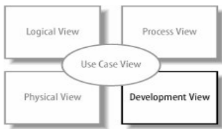


## What Is a Component?
- A component is **an encapsulated, reusable**, and **replaceable** part of your software.
  - 构件是封装的、可复用的、可替换的软件部件
  - 可以将部件看作是软件构造块，将它们联结在一起形成软件
  - 构件的可以是小到一个类，也可以大到一个子系统
  - 执行一个关键功能并在系统中频繁使用的项可能被看作构件
    - 例如，loggers, XML parsers, or online shopping carts
- 在自己的系统中
  - 可以使用已有构件
  - 可以创建提供服务或数据访问的构件


## UML中的Component
- 在UML中，构件和类或组合结构的相同之处
  - 泛化、与其他构件关联、实现接口、有操作
  - 有端口，能显示内部结果
- 构件和类的主要区别
  - 构件具有的责任通常比类大
  - 构件通常包含并使用其他的类或构件来实现自己的功能
- 构件之间最好是松散耦合的
  - 对一个构件的修改不应该影响到系统的其余部分
  - 通过接口访问构件有助于松散耦合和封装
    - 接口将行为和其实现分离


## 构件的UML表示法
- 构造型 `<<component>>`
  - 建模工具差异
    - 右上角图标可选
    - UML1.X的表示法

  
- 构造型 `<<subsystem>>`
  - 说明构件实际上是子系统
  - 子系统是作为较大系统一部分的次级或从属系统

  


## 供接口和需接口
- 要使构件松散耦合最好通过接口交互
  - 控制构件之间的依赖性，使之可替换
- 构件的供接口（provided interface）是该构件实现的接口
  - 供接口描述了构件**提供的服务**
  - 其他构件和类通过构件的供接口与其交互
- 构件的需接口（required interface）是构件要工作所需要的接口
  - 构件需要其他的类或构件实现需接口才能工作
  - 需接口声明了构件**需要的服务**
  - 构件通过需接口访问实现该接口的类或构件
- 在UML中表示供接口和需接口的方法
  - ball and socket 符号
    - 最常用的表示法
  - 构造型表示法（stereotype notation）
    - 可以显示接口的操作
  - 文本列举text listings
    - 比较紧凑
  - 根据建模要描述的信息选择使用上面的表示法
- Ball and Socket Notation for Interfaces
  - ball symbol 表示供接口
  - socket symbol 表示需接口
  - 将接口的名字写在符号旁

  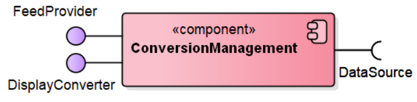
- Stereotype Notation for Interfaces
  - 使用带构造型的类记号表示构件的供需接口
  - 如果构件实现了一个接口，画一个从构件到接口的实现（realization）箭头
  - 如果构件需要一个接口，画一个从构件到接口的依赖（dependency）箭头
  - 这种表示法能够描述供需接口的操作等内部细节

  
- Listing Component Interfaces
  - 将供需接口在构件内分别列出
  - `<<provided interfaces>>`
  - `<<required interfaces>>`
  - 还可以加上 `<<artifacts>>` 列出制品或物理文件
    - 取决于建模工具的特性

  


## 描述一起工作的构件
- 一起工作的构件
  - 如果构件有一个需接口，那么需要系统中的其他类或构件来提供该接口（构件依赖）
- 表示法
  1. 描述系统中的关键构件以及它们通过接口互相连接
  2. 描述构件依赖的简化高层视图，强调构件依赖并列出构件功能的物理实现制品
- 表示法一
  - 从构件的需接口到另一构件的供接口画一个依赖箭头
  - 例如，ConversionManagement构件需要 DataSource接口，该接口由 BlogDataSource构件提供

  
- 省略依赖箭头的表示法
  - 组装连接器表示法（assembly connector notation）

  
- 表示法二
  - 省略接口，直接画一个构件之间的依赖关系
  - 也可以把构件的内部细节表示出来

  
- 选择表示法时要注意
  - 接口有助于构件之间松散耦合，它们是构件架构中的重要因素
  - 第一种表示法的焦点是系统中的关键构件和接口
    - 对描述系统架构很有帮助
  - 第二种表示法着重于构件依赖和实现制品，可用于控制系统的配置和部署
    - 对理解系统的配置管理或部署问题比较有用
    - 强调了构件依赖并列出了构件功能的物理实现制品，可以清楚地看到部署时需要哪些构件和相关的文件
- 焦点是系统中的关键构件和接口
  
- 着重于构件依赖和实现制品
  


## 实现构件的类
- 实现构件的类
  - 构件通常包含和使用其他的类来实现自己的功能
  - 可以说这样的一些类实现了（realize）一个构件
- 实现构件的类的表示法
  1. 将实现类和它们之间的关系画在构件内
  2. 将实现类画在构件外，通过实现依赖连接到构件
  3. 在构件中的 `<<realizations>>` 栏列举出来
- 表示法一
  - Blog 和Entry 类实现了 BlogDataSource 构件
  - Blog 和Entry之间是聚合关系

  
- 表示法二
  - 将构件的实现类画在构件外
  - 将类用实现依赖连接到构件

  
- 表示法三
  - 在构件中 `<<realizations>>` 部分列举

  
- 如何选择使用哪种表示法？
  - UML建模工具的支持
  - 第一种是最常用的表示法
    - 将类画在构件内部，强调这些类组成构件并完成其功能
  - 将实现类列出是一种紧凑的表示法，但是不能显示实现类之间的关系
    - 前两种方法可以


## 端口和内部结构
- 构件可以有端口和内部结构
  - 可以使用端口对构件被使用的方式建模
    - 将相关的接口连接到该端口
    - 端口显示构件的独特使用并将“类似”的接口放在一组

  
- 可以显示构件的内部结构
  - 对它的组成部分、属性和连接器建模

  

  
- 构件有自己独特的构造块来表示端口和内部结构
  - 代理连接器（delegation connectors）
  - 组装连接器（assembly connectors）
- 这些连接器用来描述
  - 构件的接口如何与其内部组件（parts）匹配
  - 构件的内部组件如何一起工作


## 代理连接器
- 构件的内部组件实现或使用构件的接口
  - 构件的供接口可以由构件的某个内部组件实现
  - 构件的需接口也可能只是其某个内部组件所需要的
- 用代理连接器可以描述接口与内部组件的对应
  - 代理连接器用箭头将与接口相联系的端口连接到内部组件上
    - 如果组件实现了一个供接口，那么箭头从端口指向内部组件
    - 如果组件使用一个需接口，那么箭头从内部组件指向端口
- 例
  - Blog 类实现了 DataSource 接口
  - Entry 类需要 Logger 接口

  
- 可以这样看代理连接器
  - 端口是开放的构件的通信通道，代理连接器则指出了通信的方向
    - 从端口指向内部组件的代理连接器就表示消息被传递给了处理该消息的组件
- 代理连接器还可以连接端口和内部组件的接口
  - 如果图中显示了内部组件的接口，那么可以直接将代理连接器连到其接口
  - 在一个构件中包含其他构件时经常使用这种表示法代理连接器
  - ConversionManagement 构件中包含Controller和BlogParser构件
  - ConversionManagement 构件对外提供了FeedProvider接口，但这个接口实际上是由Controller组件实现的

  


## 组装连接器
- 组装连接器（assembly connectors）
  - 说明一个构件需要另一构件提供的接口
  - 用于描述构件的内部结构，表示内部构件通过接口一起工作

  
- 组装连接器是为表示构件的组合结构而定义的一种连接器
  - 也可以用来表示构件通过接口相互依赖

  


## 连接器小结


## 构件视图
- 黑盒视图（black-box view）
  - 说明构件从外部看起来是怎样的，包括其供接口和需接口，以及它与其他构件的关系
  - 不描述构件的内部实现，通常包含多个构件
  - 长于说明系统中的关键构件以及它们如何连接
- 白盒视图（white-box view）
  - 说明哪些类、接口和其他构件帮助一个构件实现其功能
  - 通常着重于一个构件的内容，显示构件内部的组成部分
  - 长于说明构件如何通过其使用的类实现自己的功能


## 端口和接口


## 构件的黑盒视图


## 构件的白盒视图


## What's Next?
- Composite structures 组合结构
  - 构件图和组合结构图中有很多相同的概念
    - 组合机构图中定义了类的端口和内部结构
  - 构件继承了这些概念，同时引入了自己的一些特征
    - 连接代理器
    - 组装代理器
- Deployment Diagrams 部署图
  - 构件如何被部署到硬件上


## 小结
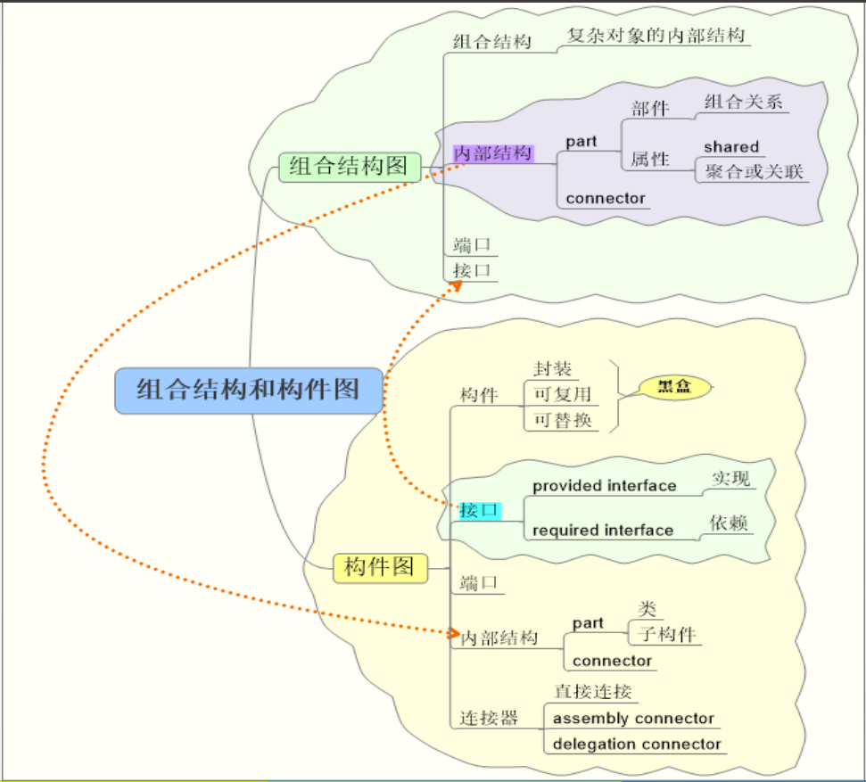


# U10 包（Package）图：组织系统模型
- 包（Package）
- Namespace和可见性
- 关系
- 包图建模用途

## 包（Packages）
- 为什么要用包？
  - 当程序的复杂性增加时，很容易就包含成百上千的类
  - 面对如此庞大的类库怎么办？
  - 将类组织成逻辑分组易于管理和理解
  - 大多数面向对象语言具有某种结构组织类和避免名字冲突
    - C++ namespace，java package
- 在UML中，类的分组用包建模
  - 可以用 UML packages 对程序语言中的这些结构建模
  - 包可以组织几乎任何UML元素，不仅是类
    - 例如用例
- 包是UML的分组机制
  - 每个元素都属于一个包（或其他元素）


## 可以放在包里的元素
- packageable element
  - 可以直接放在包中的元素
- 包的直接元素包括
  - classifiers,
  - dependencies
  - constraints
  - instance specifications
  - other packages
- Kinds of classifiers include
  - use case, behavior, collaboration, signal
  - actor, class, data type, interface, component, subsystem (as a stereotype), node, association


## UML的package概念
- A general-purpose mechanism for organizing elements into groups, establishing ownership of elements, and providing unique names for referencing elements.
  - 用于将元素组织成组、建立元素的所有权以及为引用元素提供唯一名称的通用机制
- 语义
  - 通用的分组机制
  - 命名空间
  - 元素可见性
  - 包可以嵌套
  - 包之间的依赖关系
- 包主要用于模型管理
  - 访问和配置控制


## 包图
- 有包图吗？
  - 有的UML建模工具中可能没有称为包图的图
  - 包是用于组织几乎所有 UML 元素的分组结构，但它们最常见的用途是在类图中组织类
- 包图
  - 关注系统的各部分如何被组织为模块和包
  - 常用于查看包之间的依赖性
  - 理解包之间的依赖性对于软件的稳定性非常重要


## 包表示法
- 创建包
  
- 包的表示法
  - 包的名字在没有显示包内的元素时也可以显示在包中间

  
- CMS中的包如下图所示
  - 每个包代表系统的一个特定关注方面

  


## 包的内容
- 包的内容有两种表示方法
  - 将内容画在包记号中，如左图，这时将包的名字写在tab上
  - 将内容画在包外，用线（嵌套）连接到包，如右图

  
- 一个包还可以包含其他的包
  - 可以多层嵌套

  
- 怎么显示嵌套内层的包及其内容？
  - 将包展开：用 packageA::packageB::packageC 如此类推表示

  


## Namespace 名空间
- 一个UML包建立了一个名空间
  - 如果在一个包中使用来自另一个包的元素，需要指出其位置
  - fully-scoped name 指定UML元素所处的上下文，包括包的名字，例如 `packageName::className`.
  - 同一个包中的元素名字要唯一
  - 不同包中如果有同名元素，用它们的全名区分
  - 嵌套包隐含的语义是“继承”名空间
    - 内层包中可以直接使用外围包中的名字，无需限定


## Namespace
- 限定名
  
- 名字唯一
  


## 元素可见性
- 包中的元素可以具有public 或 private可见性
  


## 包的依赖
- 如果一个包中的类要使用另一个包中的元素，则引起包之间的依赖
  - 如图，如果A中一个元素使用B中的一个元素，则包A依赖包B
    
- 理解包之间的依赖有助于分析系统的稳定性
  


## Importing Packages
- import关系（导入、引入）
  - 如果A imports B，那么包B中的元素可以在A中不用全名使用
    - public元素可用，private元素仍不可见
  - 其中B又称为target package
- 表示法
  - 用标注有 `<<import>>` 构造型的依赖箭头表示

  
- users 包导入了security包
  
- 一个包也可以只导入另一个包中的某个特定元素
  - users 包只导入了security包中的 Credentials 元素，而不是整个包

  


## Accessing Packages
- public import 和 private import
  - public import（默认的），被导入的元素在导入它的包名空间中具有public可见性
  - private import：被导入的元素在导入它的名空间中具有private可见性
  - 私有引入可以使用`<<access>>`构造型表示
- import 和 access 的区别
  - 被导入的元素具有public可见性，可以被进一步导入到其他包（传递）
  - access则不能
- A 可以看到C中的public元素，但不能看到D中的
  


## 管理包的依赖关系
- 复杂的依赖关系可能使软件系统不够稳定
  - 一个包的改变会影响所有依赖于它的包
  - 例如，下图中任一个包的修改都会影响到其他包
    
- 一些原则
  - avoiding cyclical package dependencies 避免循环依赖
  - depending in the “direction of stability”
    - 如软件体系结构中的依赖关系：上层依赖下层
    - 易变的包依赖稳定的包
- 去除循环依赖的方法
  - 析出一个新的包，让两个包都依赖这个新包
    - 如下图
      
  - 考虑能否将它们放在同一个包中

## 组织用例
- 可以用包来组织用例
  - 包可以用来将功能相似的类组织在一起
  - 包还可以用来组织其他的UML元素，如用例
  - 将用例组织成更高的层次有助于组织模型，可以看到参与者与系统的哪部分交互
    - 如图，CMS的用例包
      

  


## 对系统架构建模
- 典型的三层架构
  - 例如图书馆系统
    


## 管理系统模型


## What's Next?
- 包用来对UML元素进行分组，如类和用例
  - class diagram
  - use case diagram
- 包图的一个重要应用是查看系统中的依赖关系
  - 其他一些重要的高层系统图包括构件图和部署图
  - 构件图：显示关键的软件部分
  - 部署图：软件部分如何部署到硬件


## 部署图（Deployment Diagram）：对部署的系统建模
- 节点（Node）
- 工件（Artifact）
- 关系
- 部署图建模

---
- UML的部署图显示系统的物理视图
  - 显示运行时处理节点的配置及其上存在的工件。
  - 描述软件被如何分配到硬件和各部分如何通讯，从而将软件带到了现实世界
  - 部署图可以在类级别或实例级别
  - 在部署图中，“系统”指所创建的软件和软件运行的硬件系统
- 部署视图（Deployment view）
  - 显示分布式系统中的节点、存储在每个节点上的工件以及工件所体现的组件和其他元素的视图。


## 部署图的基本概念
- 部署（Deployment）
  - The assignment of software artifacts to physical nodes during execution.
- 工件（Artifact）
  - Artifacts model physical entities, such as files, scripts, database tables, text documents, and web pages.
- 节点（Node）
  - Nodes model computational resources, such as computers and disk drives.
- manifest dependency
  - manifestation依赖建立工件与其实现的逻辑元素之间的关系
- 设备和执行环境（Device and execution environment ）
  - 各种节点，其间的区别模糊，可能被忽略
- 通信路径（Communication path）
  - 节点之间的关联，允许节点交换消息和信号。
  - 网络可以建模为通信路径连接的节点。


## 节点（Node）
- 一个简单系统的部署图示例
  - 这个系统软件作为可执行文件发布，在单机上运行
- 节点对硬件建模
  - 计算机硬件用节点表示
    
    - 本系统的硬件是一台PC
  - 构造型 `<<device>>` 表示这是硬件节点


## 工件（Artifact）
- Artifact对软件建模
  - 下图表示一个简单的工件软件制品（artifact）
    
    - 这个例子中是一个JAR文件，名为 3dpacman.jar
  - 构造型`<<artifact>>`的表示法
    - 图标
    - 文本
    - both


## 部署一个简单系统
- 完成部署图
  - 将工件画在节点里表示该软件制品被部署到硬件节点上
    - 3dpacman.jar 在一台Desktop PC上运行

  
- 模型完整吗
  - 比如要显示JVM吗？
  - 要显示操作系统吗？


## 部署图中要描述什么
- 部署图应包含对图的读者很重要的系统详细信息
  - 如果显示系统的硬件、固件、操作系统、运行时环境甚至设备驱动程序很重要，那么应该将这些包括在部署图中
  - 部署图符号可用于对所有这些类型的事物进行建模
- 系统中的不重要功能
  - 如果系统中有一个不重要的功能，那么将它添加到图中是不值得的，因为它容易使设计中那些重要的功能变得混乱或分散注意力


## 部署的软件: Artifacts
- Artifacts
  - 执行的物理文件，或软件中使用的物理文件
- 常见的artifact
  - 可执行文件，如.exe or .jar files
  - 库文件，如.dlls (or support .jar files)
  - 源文件， 如 .java or .cpp files
  - 软件运行时使用的配置文件，如 .xml, .properties, or .txt
- 表示法
  - `<<artifact>>`构造型，图标，both


## 将软件部署到节点
- 工件被部署到节点
  - 意思是该工件驻留或被安装在该节点上
- 软件被部署到节点上的表示法有3种
  - 节点内，节点外`<<deploy>>`依赖，节点内工件名列表


- 表示法的选择
  - 只列出工件能够节省空间，尤其是有很多工件时
  - 要表示工件之间的依赖关系时，用其他表示法

  


## manifest 关系
- manifest关系
  - 将（物理的）工件与它实现的逻辑元素相关
    - 软件设计时构件、包等最终形成一个或多个工件（或文件）
  - 工件可以manifest任何packageable元素
    - 构件、类、包等
- 表示法
  - `<<manifest>>`依赖
  - e.g. The artifact broadcstEngine.jar manifests the component BroadcastEngine


## 节点（Node）
- 节点是什么？
  - A node is a hardware or software resource that can host software or related files.
  - 至少有存储和计算能力，工件可以驻留其上
  - 硬件节点
    - 例如，Server，Desktop PC，Disk drives
  - 为其他软件构件提供执行环境的软件也是节点
    - 例如，操作系统，J2EE container，Web server，Application server
    - 库文件、可执行文件、属性文件等不是节点


## 硬件节点
- 节点的表示法
  - 立方体符号
  - 节点的名字Node-type是一个clasisfier

  
- 硬件节点表示法
  - stereotype <<device>>
  - 强调是硬件节点

  


## 执行环境节点
- 表示法
  - 构造型 `<<executionEnvironment>>` 强调节点是执行环境
  - 如图，一个应用服务器节点
    
  - 执行环境要在硬件上运行，不能单独存在，如图
    


## 节点实例
- 节点实例
  - 用 name : Node-type 记号表示
  - 可以强调两个节点是同一类型的不同实例

  


## 节点间的通讯
- 通讯路径（communication paths）
  - 节点间需要互相通讯来完成工作
  - 通讯路径表示节点在运行时能够互相通讯
    - 不是表示消息传递
  - 表示法：连接两个节点的实线
  - 通讯的类型可以由构造型表示
  - 如图，使用TCP/IP通讯的PC和Server
    


## 通讯路径
- 可以表示执行环境节点之间的通讯路径
  


## Deployment Specifications
- 部署规约（规范）是特殊的工件
  - 说明了其他工件如何部署到一个节点
  - 用来提供安装和配置信息
- 表示法
  - 矩形，构造型 `<<deployment spec>>`
  - 部署规约可以有属性： `name : type`
  - 部署规约实例

  
  


## 将部署规约与其描述的部署联系起来
- 方法一
  - 从部署规约画一个依赖箭头到制品
  - 都在部署的目标节点内

  
- 方法二
  - 将部署规约附到部署依赖上

  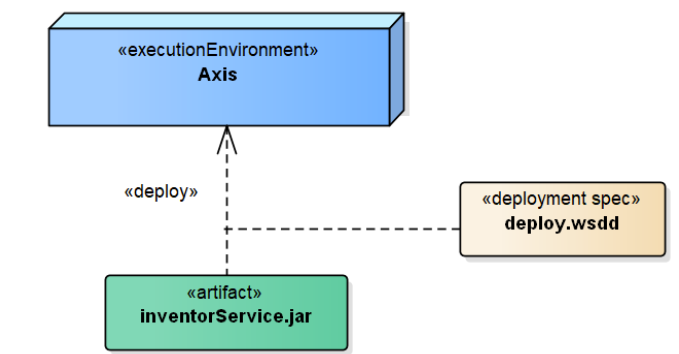


## 何时使用部署图？
- 部署图在设计过程中的各个阶段都有用
  - 开始设计系统的早期，可以用部署图对系统的重要物理布局建模
    - 例如，系统的体系结构、客户访问方式等

    
  - 在软件开发的后期，详细的部署图可以用来说明系统的实现，作为安装系统的蓝图
    


## 部署图建模——嵌入式系统


## 部署图建模——Client/Server系统


## 部署图建模——完全分布式系统


## What's Next?
- 我们已经学习了UML的基本概念
  - 进一步阅读参考文献，学习高级建模技术
  - 对象约束语言OCL
  - Profiles：定义和使用定制的UML词汇表


## 小结

