## 1.选择一个系统，描述其需求
图书管理系统。

### 需求描述
读者账户
1. 在图书管理系统中，读者可以登录注册页面，进行读者注册（账户内存储读者的个人信息和借阅记录信息）。
2. 已经注册的读者可以通过输入所注册成功的用户名和密码登录进入图书馆主页。

管理员
1. 图书管理员可以处理读者提出的申请，为读者办理图书借阅证（借阅证包含卡号，读者姓名）。
2. 持有借阅卡的读者可以通过管理员（作为读者的代理人与系统交互）借阅、归还图书。
3. 图书管理员定期或者不定期对新书上架或者是图书下架进行处理。

图书借阅及归还
1. 借阅图书时，先输入读者的借阅卡号，系统验证借阅卡的有效性和读者是否可继续借阅图书，无效则提示其原因，有效则显示读者的基本信息（包括图片），供管理员人工审核。然后输入要借阅的书号，系统查询图书信息数据库，显示图书的基本信息，供管理员人工核对，最后提交借阅请求，若被系统接受则存储借阅记录，并修改可借阅图书的数量。
2. 归还图书时，输入读者借阅卡号和图书号（或丢失标记号），系统验证是否有此借阅记录，以及是否超期借阅，无则提示，有则显示读者和图书的基本信息，供管理员人工审核。如果有超期借阅或者丢失情况，先转入过期罚款或者图书丢失处理，然后提交还书请求，系统接受后删除借阅记录，登记并修改可借阅图书的数量。

## 2.根据系统需求构造用例模型，包括：用例、用例描述、用例图

- 用例名称：读者注册
- 用例描述：读者登录注册页面，进行读者注册。
- 参与者：读者
- 前置条件：图书馆的用户注册页面正常运行
- 后置条件：如果读者注册成功，则该读者可以在网上预订图书或查询图书信息等操作。如果读者注册不成功，则不能在网上查询信息等。
- 基本路径：
  1. 读者用户进入图书馆的用户注册页面
  2. 读者输入需要注册的用户名和密码
  3. 读者将注册信息进行提交
  4. 系统对用户提交的用户名和密码进行有效性检查
  5. 系统显示用户是否注册成功

---
- 用例名称：读者登录
- 用例描述：读者登录图书馆主页面，输入所注册成功的用户名和密码
- 参与者：读者
- 前置条件：图书馆的主页面正常运行
- 后置条件：如果读者登录成功，则该读者可以进行图书的查阅等操作成功：否则不能进行图书的相关操作。
- 基本路径：
  1. 读者用户进入图书馆的登录页面
  2. 读者输入用户名和密码
  3. 读者将输入的信息进行提交
  4. 系统对用户提交的用户名和密码进行有效性检查
  5. 系统记录并显示当前登录用户
  6. 用户查阅相关的图书信息

---
- 用例名称：读者办理借阅证
- 用例描述：读者向系统管理员提出申请，办理图书借阅证。
- 参与者：读者
- 前置条件：系统管理员进行信息的审核
- 后置条件：如果读者申请办理图书借阅证成功，则该读者可以进行图书的借阅等操作；否则，不能借阅图书。
- 基本路径：
  1. 读者携带有效证件向系统管理员提出申请
  2. 系统管理员对读者的个人信息进行审核；
  3. 读者的个人信息审核通过，系统管理员授予图书借阅证

---
- 用例名称：读者借阅图书
- 用例描述：读者携带图书借阅证进行图书的借阅。
- 参与者：读者
- 前置条件：图书馆正常开放
- 后置条件：如果读者的图书借阅证扫描成功，读者进入图书馆借阅，进行图书的借阅等操作；否则，不能借阅图书。
- 基本路径：
  1. 读者携带图书借阅证进入图书馆
  2. 用户到图书馆查阅相关的图书信息
  3. 读者向图书管理员提出借阅图书的请求；
  4. 图书管理员检查借阅证的有效性
  5. 图书管理员检查读者有无超期未还信息
  6. 图书管理员允许读者借阅图书。
  7. 系统添加借阅信息。

---
- 用例名称：读者归还图书
- 用例描述：读者到图书馆归还所借阅的图书
- 参与者：读者
- 前置条件：图书馆正常开放、读者携带图书借阅证及所需还的书。
- 后置条件：如果归还了图书，下次可以正常借书。
- 基本路径：
  1. 读者携带图书借阅证，进入图书馆
  2. 读者归还图书
  3. 图书管理员检查读者所借图书的情况
  4. 图书管理员处理读者归还图书的请求
  5. 系统删除读者的借阅信息。
- 扩展点
  1. 图书管理员检查读者借阅的图书是否超期
  2. 图书管理员检查读者借阅的图书是否损坏
  3. 图书管理员判断读者是否缴纳罚金

---
- 用例名称：网上预订
- 用例描述：读者登录网上图书管理系统，查询到自己喜欢的书籍进行预订。
- 参与者：读者
- 前置条件：用户登录到系统中。
- 后置条件：如果这个用例成功，系统建立预定记录。否则，系统的状态没有变化。
- 基本路径：
  1. 读者登录网上图书管理系统
  2. 读者输入注册的用户名和密码进入系统
  3. 读者提供书刊种类、自己的信息
  4. 系统检索书刊信息和读者信息
  5. 系统接受预定，创建预定记录
  6. 将预定记录存储在系统中。

---
- 用例名称：书籍的日常维护
- 用例描述：图书管理员对新书上架或者是图书下架进行处理
- 参与者：图书管理员
- 前置条件：图书管理员正常工作
- 后置条件：对书籍的日常维护后，图书馆可以正常开放，用户可以顺利进行借还书等。反之，图书馆不能满足用户需求。
- 基本路径：
  1. 搜集旧书和新书的信息
  2. 对新书贴条形码；
  3. 把旧书下架
  4. 把新书上架

---
- 用例名称：处理借书
- 用例描述：在读者借阅图书时，处理读者的借书请求
- 参与者：图书管理员
- 前置条件：图书馆开放、图书管理系统正常运行时间
- 后置条件：如果读者没有借书证则不能借阅图书，否则则为他办理借阅。
- 基本路径：
  1. 读者发出借阅请求
  2. 管理员扫描读者的借书证
  3. 如果读者有罚款未交或达到借书限额则不给予办理。

---
- 用例名称：处理还书
- 用例描述：在读者归还图书时，处理读者的还书操作。
- 参与者：图书管理员
- 前置条件：图书馆开放，图书管理系统正常运行时间。
- 后置条件：完成还书操作后，读者下次可以继续借阅其他的图书，如果不及时完成还书的处理则读者可能不再具有借书权利，影响读者对图书的借阅行为。
- 基本路径：
  1. 读者发出还书请求
  2. 管理员扫描图书条形码
  3. 管理员检查图书是否有损坏，若有损坏则要求读者按要求交罚款
  4. 管理员检查图书是否超期归还，若是超期还书则要求读者按要求交罚款

---
- 用例名称：管理系统用户
- 用例描述：添加删除或修改图书管理系统中的各类图书管理员的信息
- 参与者：系统管理员
- 前置条件：系统管理员登录到系统中
- 后置条件：如果系统管理员完成对各类管理人信息的添加删除等操作，那么对应的管理人可以处理读者的借书、还书操作，以及相应的管理人顺利离开岗位，否则不能。
- 基本路径：
  1. 系统管理员查看各类图书管理员的信息
  2. 系统管理员根据实际情况，对己经辞职的管理员信息删除
  3. 系统管理员把新来的管理员信息添加到图书管理系统中
  4. 系统管理员修改图书管理员的工作范围，工作时间等信息，给图书管理员分配合理的工作。

---
- 用例名称：读者管理
- 用例描述：系统管理员对读者的信息进行添加、修改和删除。
- 参与者：系统管理员
- 前置条件：图书管理系统正常工作
- 后置条件：如果系统管理员对读者的信息添加、修改以及响应读者办理借书证的申请、网上预订，读者才可以借书、还书、办理借书证和网上预订；如果系统管理员对读者的信息进行删除，则读者不可以进行任何操作。
- 基本路径：
  1. 系统管理员进入系统
  2. 查看读者办理借书证的申请信息
  3. 审核读者信息；
  4. 添加读者信息；
  5. 修改已经修改个人信息的读者的信息
  6. 删除已经注销的读者信息
  7. 查看是否有读者超期未还书的行为，若有就添加备注和罚款信息。

---
- 用例名称：管理图书信息
- 用例描述：添加、删除或修改图书管理系统中的图书信息和图书类别信息。
- 参与者：系统管理员
- 前置条件：系统正常运行时间
- 后置条件：如果系统管理员对图书的信息添加、修改，读者才可以更准确的获得图书信息从而借到相应的书；如果系统管理员对图书的信息进行删除，则读者不可以对该图书进行任何操作。
- 基本路径：
  1. 系统管理员进入系统
  2. 删除已下架的图书信息
  3. 修改已更改的图书信息
  4. 添加新上架图书信息

---
- 用例名称：系统维护
- 用例描述：完成系统数据备份、系统数据初始化、密码设置和权限管理等操作根据需求统计图书借阅情况、在库图书情况、图书借阅排行等；发布后台公告添加、删除、修改图书管理系统中的各类罚款的额度和权限等。
- 参与者：系统管理员
- 前置条件：系统正常运行时间
- 后置条件：系统维护后使系统正常运行，图书馆可以正常开放，读者可以正常进行借书还书等，如果系统出现故障得不到维护，那么会造成系统瘫痪图书馆不能正常工作，不能为读者服务。
- 基本路径：
  1. 系统管理员进入系统；
  2. 统计读者信息
  3. 根据需求统计图书借阅情况、在库图书情况、图书借阅排行
  4. 添加、删除、修改图书管理系统中的各类罚款的额度和权限
  5. 发布后台公告；
  6. 系统数据备份。

---
