根据文档中的描述，给出系统业务场景的交互图和相应的分析类图。

## Maxi Software 800电话号码帮助台
Maxi Software是一家为个人和企业提供软件产品的开发商和供应商。作为其运营的一部分， Maxi为客户提供了一个800电话号码的服务台，为他们提供了有关从Maxi购买的软件的问题。

当来电时，话务员询问来电的性质。对于不是真正帮助台功能的电话，接线员会将其转接到公司的另一个部门。因为许多客户问题需要对产品有深入的了解，所以帮助台顾问是按产品组织的。话务员将电话转给一个对呼叫方需要的软件有熟练技能的顾问。由于顾问并不总是立即可用，因此必须将一些调用放入队列中，以等待下一个可用的顾问。

顾问接听电话后，将确定这是否是该客户关于该问题的第一个电话。如果是，他或她创建一个新的呼叫报告，以跟踪有关该问题的所有信息。如果没有，顾问向客户询问呼叫报告号码，并检索未打开呼叫报告，以确定查询的状态。如果呼叫者不知道呼叫报告号码，顾问会收集其他识别信息，例如呼叫者的姓名、所涉及的软件，或处理该问题之前呼叫的顾问的姓名，以便查找相应的呼叫报告。如果找到了客户问题的解决方案，顾问会通知客户解决方案是什么，并在报告中指出已经通知了客户，然后结束报告。如果没有发现解决方案，则咨询师确认处理该问题的咨询师是否在值班。如果是，该呼叫将被转移到另一个咨询师(或者将其放入等待该咨询师处理的呼叫队列中)。

一旦合适的顾问接到电话，他或她记录下客户的任何新细节。对于持续存在的问题和新的呼叫报告，咨询师试图通过使用相关软件和查阅参考手册中的信息来发现问题的答案。如果问题可以解决，顾问告诉客户如何处理问题，并关闭呼叫报告。否则，顾问将报告存档，以便继续研究，并告诉客户Maxi会有人与他或她联系，或者如果客户发现了关于问题的新信息，则用指定的呼叫报告号码回电确定问题。

## 图书管理系统

