提交一份PDF文档，其中包含完整的系统分析模型：
1. 每个用例的实现，用交互图描述。(10分)
2. 完整的分析类图，要求与其他模型一致。(10分)
3. 系统架构描述，用户界面原型。(10分)

---

## 交互图
<!-- 描述每个用例的实现 -->
借书

还书

缴纳罚款

## 分析类图

## 系统架构描述

## 用户界面原型
登录页面
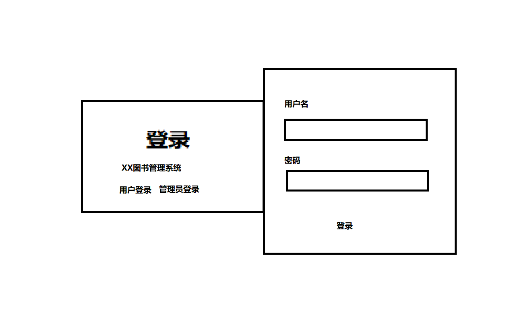

图书查询
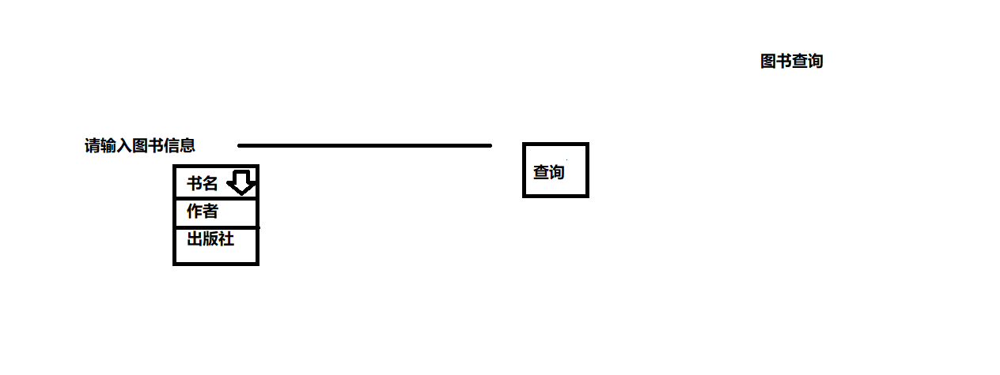

用户借书
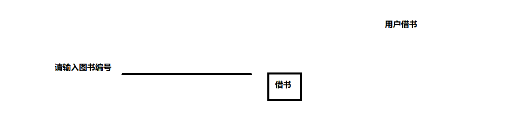

借书查询
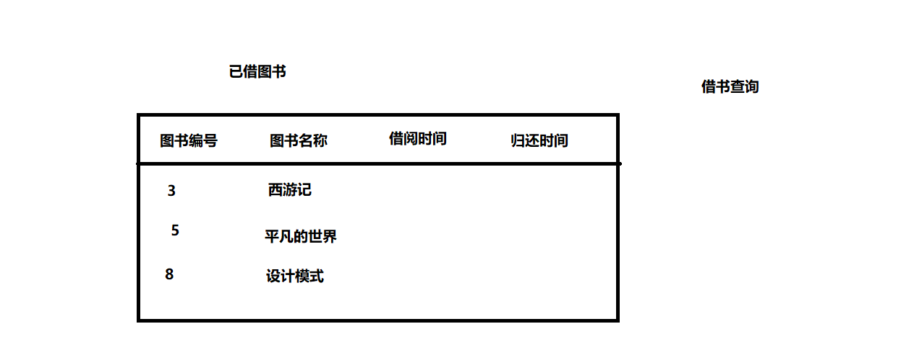

用户信息
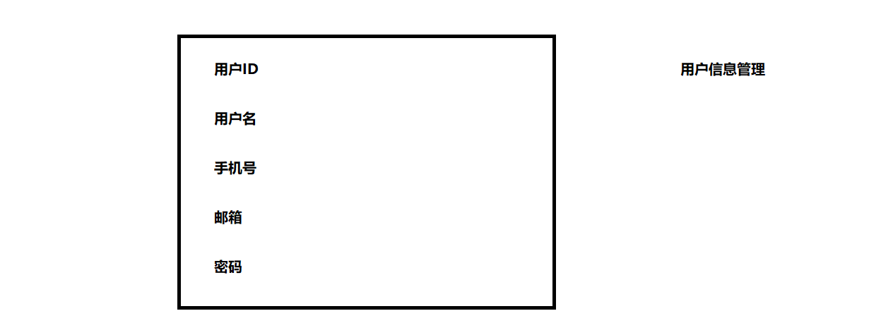

添加书籍
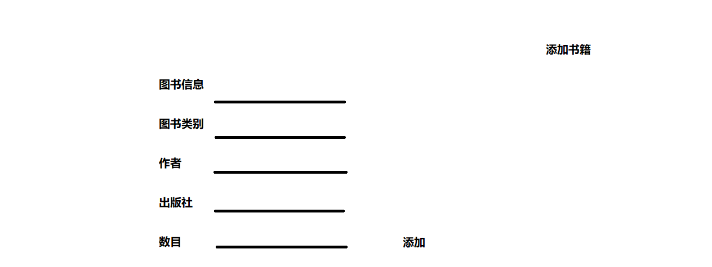
