提交一份PDF文档，包含完整的系统设计模型：
1. 设计类图：系统的概要类图和架构层次，核心类的详细设计类图。(10分)
2. 重点类的状态机图。(10分)
3. 核心用例的细化交互图（包括设计类在内）。（10分）
4. 数据库设计和用户界面设计。(10分)

---

## 设计类图
<!-- 系统的概要类图和架构层次，核心类的详细设计类图。(10分) -->
<!-- ps：网上搞得代码跑不起来，有点难受。 -->
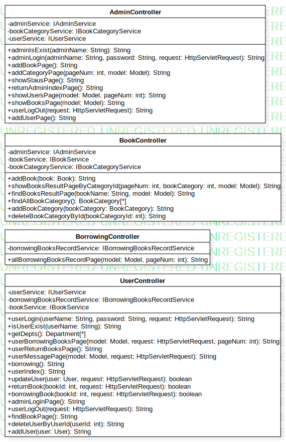

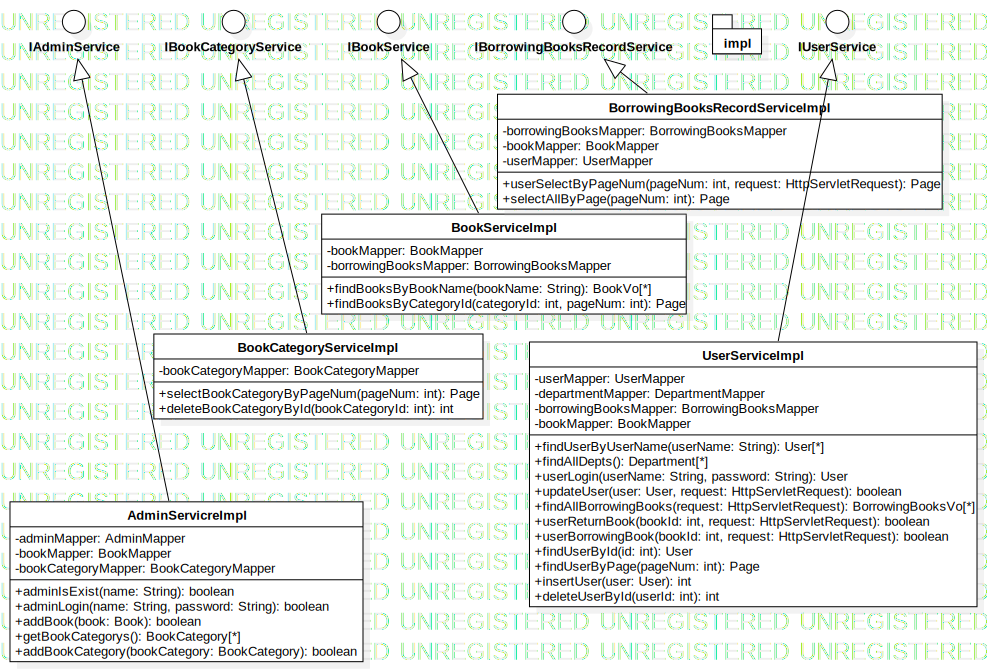

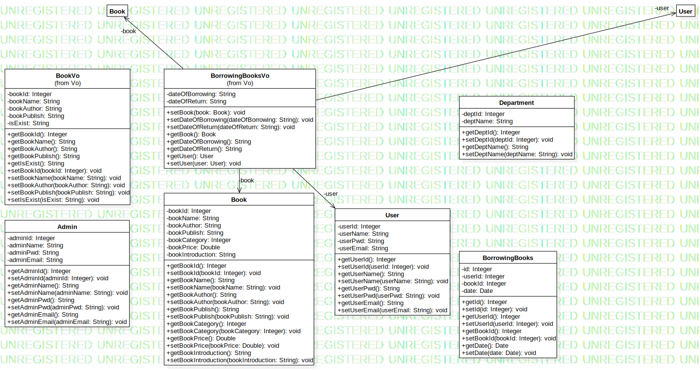

## 状态机图
<!-- 重点类的 -->

## 细化交互图
<!-- 核心用例（包括设计类） -->
用户登录
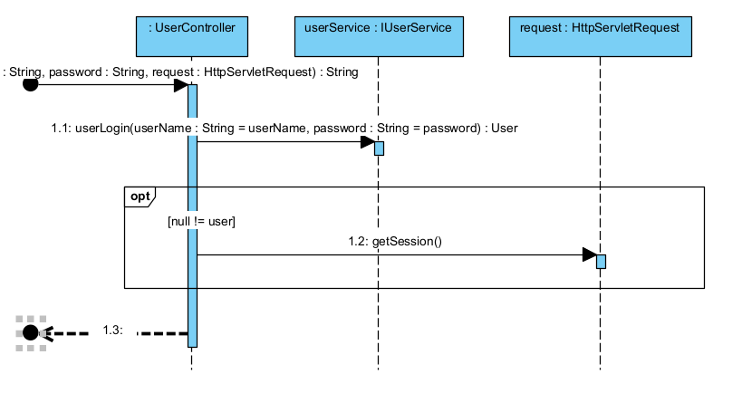

判断用户是否存在
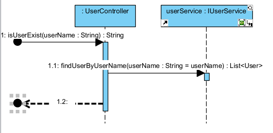

用户借书
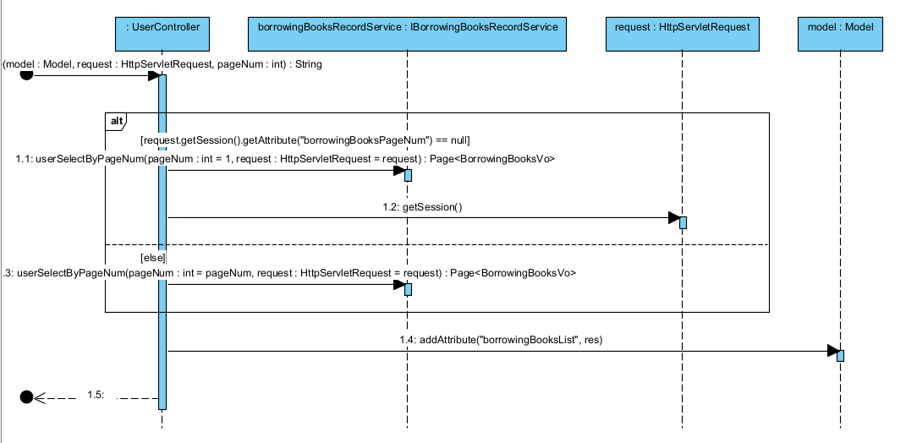

用户信息
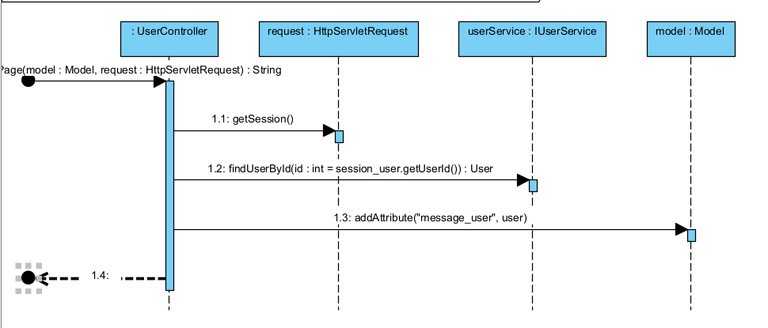

更新用户信息
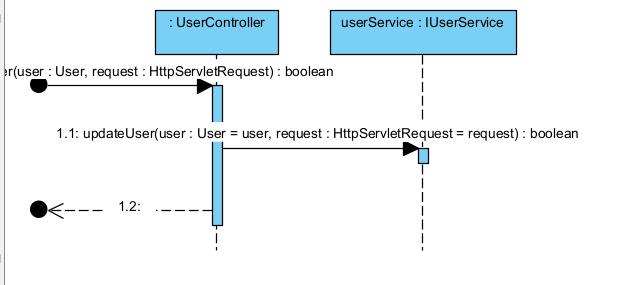

还书
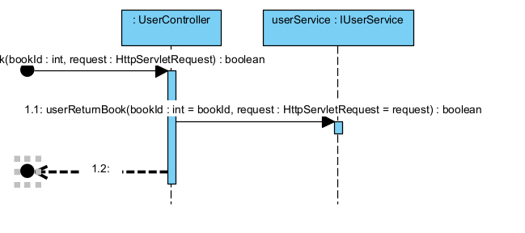

借书
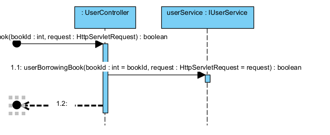

注销
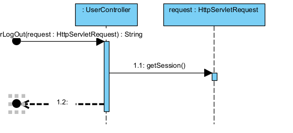

删除用户
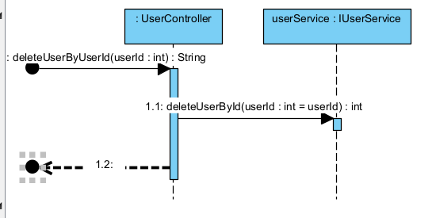

添加用户
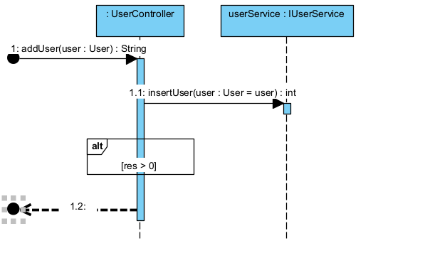

借书记录查询
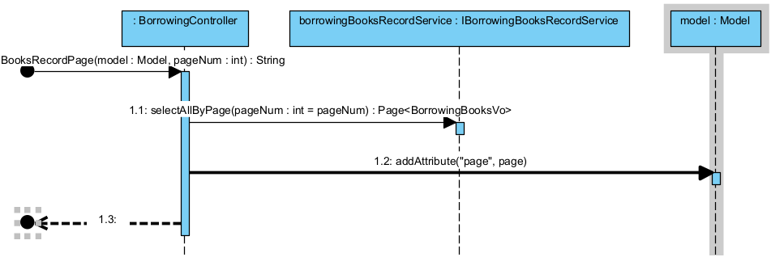

添加图书
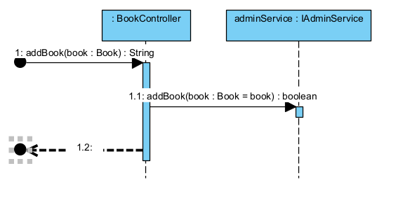

展示图书查询结果
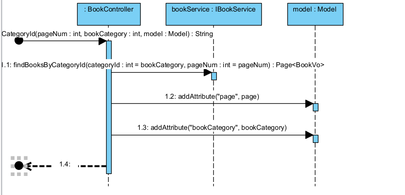

管理员登录
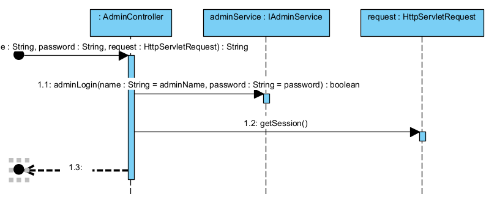

用户管理
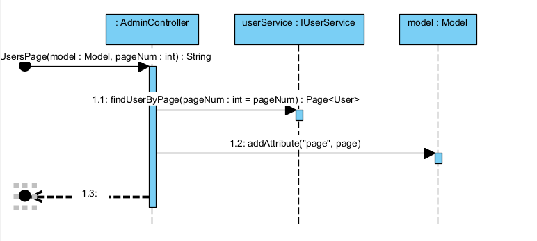

展示图书
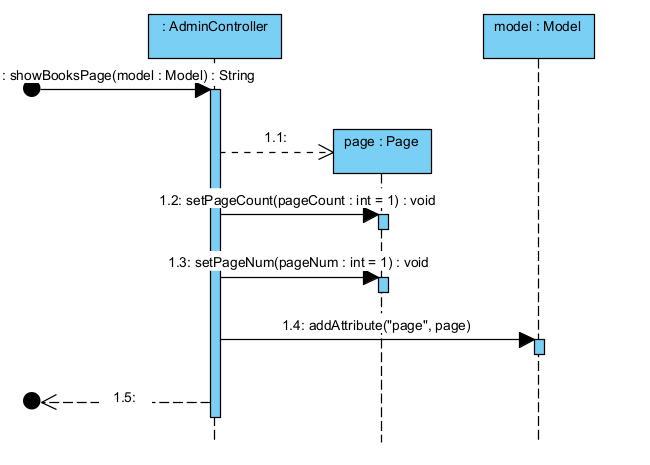

## 数据库设计
图书
| 项     | 字段名            | 字段类型 | 约束                                |
| ------ | ----------------- | -------- | ----------------------------------- |
| ID     | book_id           | int      | NOT NULL AUTO_INCREMENT PRIMARY KEY |
| 名称   | book_name         | varchar  |                                     |
| 作者   | book_author       | varchar  |                                     |
| 出版社 | book_publish      | varchar  |                                     |
| 分类   | book_category     | int      |                                     |
| 价格   | book_price        | double   |                                     |
| 简介   | book_introduction | varchar  |                                     |

借书记录
| 项       | 字段名  | 字段类型 | 约束                                |
| -------- | ------- | -------- | ----------------------------------- |
| ID       | id      | int      | NOT NULL AUTO_INCREMENT PRIMARY KEY |
| 用户标识 | user_id | int      | FOREIGN KEY                         |
| 图书编号 | book_id | int      | FOREIGN KEY                         |
| 日期     | date    | date     |                                     |

用户/管理员类
| 项   | 字段名 | 字段类型 | 约束                                |
| ---- | ------ | -------- | ----------------------------------- |
| ID   | id     | int      | NOT NULL AUTO_INCREMENT PRIMARY KEY |
| 名称 | name   | varchar  |                                     |
| 密码 | pwd    | varchar  |                                     |
| 邮箱 | email  | varchar  |                                     |

## 用户界面设计
<!-- ps：可能因为没有经过thymlef渲染，样式表似乎没有被加载出来 -->
登录页面

图书查询

用户借书

借书查询

用户信息

添加书籍

