## 1.构造ATM机的状态机图

## 2.了解电梯的工作过程，构造电梯的状态机图

## 3.完成PTA系统中的状态图练习题

### 1
The lights in a lecture theatre are controlled by a panel of three switches, labeled ‘On’, ‘Off’ and ‘Dim’. ‘On’ switches the lights on to their full brightness, and ‘Off’ switches them off. There is also an intermediate level of brightness, used when slides and other projected material are being shown. The ‘Dim’ switch reduces the lighting level from full to this intermediate level; full brightness can be restored by pressing the ‘On’ switch again. Draw a state diagram modelling the behaviour of the lighting system in this lecture theatre. 

讲堂里的灯由三个开关组成的面板控制，分别标有“开”、“关”和“暗”。“开”是把灯开到最大亮度，“关”是把灯关了。还有一个中间亮度级别，用于放映幻灯片和其他投影材料。“昏暗”开关将照明水平从充分降低到这个中间水平;通过再次按“开”开关，可以恢复完整的亮度。画一个状态图，模拟这个讲堂的照明系统的行为。

### 2
A window in a window management system can be displayed in one of three states: maximized, where it takes up the entire screen; normal, where it is displayed as a bordered window with a given size and position on the screen; and iconized, where it is displayed as a small icon. When a window is opened, it will be displayed as a normal window, unless minimize on use has been selected, in which case it will be displayed as an icon. A normal window and an icon can be maximized; a maximized window and a normal window can be minimized, or reduced to an icon. Maximized windows can be restored to their normal size, and icons can be restored to the size they had before they were minimized. Icons and normal windows can be moved, and normal windows can also be resized. No matter how it is displayed, a window can always be closed. Draw a state diagram expressing these facts about the display of windows. 

窗口管理系统中的窗口可以以三种状态之一显示:最大化状态，即占据整个屏幕;Normal，它以屏幕上给定大小和位置的边框窗口的形式显示;图标化，显示为一个小图标。当打开一个窗口时，它将显示为普通窗口，除非选择了最小化使用，在这种情况下，它将显示为图标。一个普通窗口和一个图标可以最大化;最大化窗口和普通窗口可以被最小化，或者简化为一个图标。最大化的窗口可以恢复到正常大小，图标可以恢复到最小化之前的大小。图标和普通窗口可以移动，普通窗口也可以调整大小。无论如何显示，窗口总是可以关闭的。绘制一个状态图来表示关于窗口显示的这些事实。

### 3
A description of the behaviour of an automated telling machine (ATM) is given below. Produce a state diagram describing its behaviour. List any assumptions you have to make as a result of ambiguity, unclarity or incompleteness of the description. A user begins a transaction at the ATM by entering a bank card. Assuming that the card is readable by the machine, the user is prompted to enter their personal identification number (PIN). Once this number has been entered, a menu is presented to the user containing the following options: show account balance, withdrawal with receipt or withdrawal without receipt. If the user selects one of the withdrawal options, they are prompted to enter an amount of money to withdraw; the amount entered must be a multiple of 10. The user’s PIN is validated when the ATM sends the details of the transaction to the bank’s remote computer. If the PIN was invalid, the user is given the option of reentering it, and the selected transaction is retried. This is repeated if the new PIN is also invalid. Once three invalid PINs have been entered, the transaction is terminated and the user’s card is retained by the machine. If a valid PIN was entered, further processing depends on the transaction type selected. For a ‘show balance’ transaction, the balance is displayed on the screen, and after confirming this, the user is returned to the transaction menu. A withdrawal transaction may fail if the user has exceeded the amount of money that can be withdrawn from the account; in this case an error message is displayed, and after confirmation, the user is returned to the transaction menu. Otherwise, the user’s card is returned and the money is issued, followed by the receipt if required. At any point where user input, other than a simple confirmation, is required, a ‘cancel’ option is provided. If this is selected, the user’s card is returned and their interaction with the ATM terminates. 

下面描述自动取款机(ATM)的行为。生成一个描述其行为的状态图。列出由于描述不明确、不清晰或不完整而产生的任何假设。用户在自动柜员机上输入银行卡开始交易。假设该卡可被机器读取，用户将被提示输入他们的个人识别号码(PIN)。一旦输入了这个数字，用户就会看到一个菜单，其中包含以下选项:显示账户余额、有收据提款或无收据提款。如果用户选择了其中一个提款选项，系统会提示他们输入要提款的金额;输入的金额必须是10的倍数。当ATM将交易的详细信息发送到银行的远程计算机时，对用户的PIN进行验证。如果PIN无效，则向用户提供重新输入它的选项，并重试所选事务。如果新的PIN也是无效的，则重复此操作。一旦输入了三个无效的pin，交易就会终止，用户的卡片将被机器保留。如果输入了有效的PIN，则进一步的处理取决于所选的事务类型。对于“显示余额”交易，余额显示在屏幕上，确认后，用户返回到交易菜单。如果用户已经超过了可以从帐户中提取的金额，取款交易可能会失败;在这种情况下，将显示一条错误消息，在确认之后，将用户返回到事务菜单。否则，将退还用户卡并发放现金，如果需要的话，还会附上收据。在任何需要用户输入(而不是简单的确认)的地方，都会提供一个“取消”选项。如果选择此选项，则返回用户的卡片，并终止与ATM的交互。

### 4
A simple digital watch consists of a display showing hours and minutes separated by a flashing colon, and provides two buttons (A and B) which enable the display to be updated. (a) To add two to the number of hours displayed, the following actions should be performed, where button B increments the hours display: Press A; press B; press B; press A; press A. Draw a simple statechart showing precisely this sequence of events. (b) In the above interaction, the hours displayed could be incremented by any required number, and the whole interaction could be repeated as often as required. Redraw the statechart to incorporate these generalizations. (c) To increment the number of minutes displayed by the watch, button A can be pressed twice, followed by repeated presses of button B, each of which increases the minutes displayed by 
Draw a complete statechart for the watch, incorporating updates to both the hours and minutes displayed. Give the states in your statechart meaningful names, and add appropriate actions to any transition labelled ‘press B’. (d) The watch is subsequently enhanced to incorporate an alarm, and the following interaction is proposed as a way of setting the time of the alarm: Press A; press A; press B (repeatedly); press A; press B (repeatedly); press A. The intention is that the user presses button A twice in quick succession, like a ‘double click’ with a mouse. Explain how this proposal would introduce non-determinism into the statechart for the digital watch. Show how you could remove the non-determinism by introducing an extra state into the statechart. 

一个简单的电子表由一个闪烁的冒号分隔的小时和分钟显示器组成，并提供两个按钮(A和B)，使显示器能够更新。(a)要使显示的小时数增加2，应执行以下操作，其中按钮B使显示的小时数增加:按a;按B;按B;按下一个;画一个简单的状态图，精确地显示这一系列事件。(b)在上述互动中，所显示的小时数可按要求增加，整个互动可按需要重复。重新绘制状态图以合并这些概括。(c)要增加手表显示的分钟数，可以按两次按钮A，然后重复按两次按钮B，每按一次按钮B，显示的分钟数就增加
为手表画一个完整的状态图，包括显示的小时和分钟的更新。给你的状态图中的状态起一个有意义的名字，并给任何标记为“按B”的转换添加适当的动作。(d)随后，手表被增强，增加了报警功能，建议采用以下交互方式设置报警时间:按a键;按下一个;按B(重复);按下一个;按B(重复);按A的目的是让用户连续快速按两次按钮A，就像用鼠标“双击”一样。解释这个提议如何将非决定论引入到电子表的状态图中。演示如何通过向状态图中引入额外的状态来消除不确定性。

### 5
Draw a statechart summarizing the information given in the following description some of the events that can arise in the life cycle of a thread in Java. When a thread is created, it does not start running immediately, but is left in the New Thread state. When the thread is in this state, it can only be started or stopped. Calling any method besides start or stop makes no sense, and causes an exception to be raised. The start method causes system resources to be allocated to the thread, and calls the thread’s run method. At this point the thread is in the Running state. A thread becomes not runnable if either its sleep or suspend methods are called. The sleep method has a parameter specifying the length of time the thread should sleep for; when this time has elapsed the thread starts to run again. If the suspend method has been called, the thread only runs again when its resume method is called. A thread can die in two ways. It dies naturally when its run method exits normally. A thread can also be killed at any time by calling its stop method. 

绘制一个状态图，总结以下描述中给出的信息，其中包括Java中线程生命周期中可能出现的一些事件。当一个线程被创建时，它不会立即开始运行，而是保持在New thread状态。当线程处于这种状态时，只能启动或停止它。调用除start或stop之外的任何方法都没有意义，并且会引发异常。start方法会将系统资源分配给线程，并调用线程的run方法。此时，线程处于Running状态。如果调用线程的睡眠或挂起方法，线程将不可运行。sleep方法有一个参数，指定线程应该休眠的时间长度;当这段时间过去后，线程再次开始运行。如果已经调用了suspend方法，则只有在调用其resume方法时，线程才会再次运行。线程可以以两种方式死亡。当它的run方法正常退出时，它自然死亡。一个线程也可以在任何时候通过调用它的stop方法被杀死。

<!--  -->

---

