## “电话帮助台”系统描述
某软件公司为客户提供了一个电话帮助台。遇到问题的客户电话打进来时，接线员询问电话的性质。如果不属于帮助台的职责，接线员将电话转接到公司的其他单位（比如订单处理）。
帮助台有多名顾问，按照软件产品组织。接线员将电话转给熟悉求助者需要的软件技术的顾问。如果所需的顾问不能立即接电话，那么电话被放入等待该顾问的队列中。
顾客打电话报告的问题会有一份相应的电话报告，对于未解决的问题，电话报告处于开放状态，已解决并回答过客户的问题，报告处于关闭状态。
顾问接电话之后，会确认这是不是这位客户就这个问题第一次打电话。如果是，顾问创建一份新的电话报告，记录客户的姓名、电话和关于该问题的所有信息。如果不是，顾问向客户询问已有电话报告的编号，并查找电话报告，确定报告目前的状态是否为开放。如果客户不能提供电话报告的编号，那么也可以通过客户的姓名、电话号码进行查询。
如果已经有了问题的解决方案，那么顾问告知客户解决方案，在报告上注明已经告知了客户，并关闭该报告。如果还没有找到问题的解决办法，那么顾问查看处理这个问题的顾问是否正在上班。如果在，就将电话转给那位顾问（或者放入等待由该顾问处理的电话队列）。
合适的顾问接了电话之后，会记录下该客户提供的新细节。对待处理的问题或者新建的电话报告，顾问尝试使用相关软件和查找参考手册来找到问题的答案。如果问题可以解决，顾问就告诉客户如何处理这个问题并关闭电话报告。否则，顾问将报告归档，准备继续研究，并告诉顾客公司有人会回电话给他，客户如果发现了关于问题的新信息，也可以再打电话回来，用指定的电话报告编号来确认问题。

---
- 用例名称：客户电话打进来
- 用例描述：客户打入电话询问问题。
- 参与者：客户、接线员
- 前置条件：“电话帮助台”系统正常运行。
- 后置条件：遇到问题的客户电话打进来时，接线员询问电话的性质。
- 基本路径：
  1. 客户电话打进来。
  2. 接线员询问电话的性质。

---
- 用例名称：电话转接
- 用例描述：接线员根据电话的性质转接电话。
- 参与者：客户、接线员
- 前置条件：遇到问题的客户电话打入。
- 后置条件：接线员根据电话的性质转接电话后，顾问或公司其他单位处理客户提问。
- 基本路径：
  1. 接线员确定问题种类。
  2. 如果不属于帮助台的职责，接线员将电话转接到公司的其他单位（比如订单处理）。
  3. 如果属于帮助台的职责，接线员将电话转接到熟悉求助者需要的软件技术的顾问。

---
- 用例名称：加入等待队列
- 用例描述：如果所需的顾问不能立即接电话，那么电话被放入等待该顾问的队列中。
- 参与者：客户、接线员、顾问
- 前置条件：接线员正常转接用户电话，属于帮助台的职责且顾问不能立即接电话。
- 后置条件：加入等待队列成功，用户的电话就被加入了等待队列，用户电话未挂断。否则，用户的电话未被加入等待队列。
- 基本路径：
  1. 接线员转接到对应顾问。
  2. 对应顾问不能立即接电话。
  3. 电话被放入等待该顾问的队列中。

---
- 用例名称：生成电话报告
- 用例描述：顾客打电话报告的问题会有一份相应的电话报告，对于已解决和未解决的问题进行记录。
- 参与者：用户、顾问
- 前置条件：电话正常接入到对应顾问
- 后置条件：对于未解决的问题，电话报告处于开放状态；已解决并回答过客户的问题，报告处于关闭状态。
- 基本路径：
  1. 对应顾问接听电话。
  2. 对应问题的电话报告被生成。

---
- 用例名称：创建新的电话报告
- 用例描述：顾问创建一份新的电话报告，记录客户的姓名、电话和关于该问题的所有信息
- 参与者：顾问、客户
- 前置条件：该用户就此问题首次打入电话。
- 后置条件：如果这位客户就这个问题第一次打电话，顾问创建一份新的电话报告。如果不是，顾问向客户询问已有电话报告的编号查找电话报告。
- 基本路径：
  1. 顾问接到用户打入的电话。
  2. 确认这是这位客户就这个问题第一次打电话。
  3. 顾问创建一份新的电话报告，记录客户的姓名、电话和关于该问题的所有信息。

---
- 用例名称：查找电话报告
- 用例描述：顾问根据电话报告的编号或客户的姓名、电话号码对电话报告进行查询。
- 参与者：顾问、客户
- 前置条件：该用户就此问题不是首次打入电话，电话报告已经被创建。
- 后置条件：找到电话报告且目前的状态为开放，查询到电话报告。否则，没有查询到电话报告。
- 基本路径：
  1. 客户提供已有电话报告的编号，或客户的姓名、电话号码。
  2. 顾问根据用户提供的信息进行查询。

---
- 用例名称：告知客户解决方案
- 用例描述：如果已经有了问题的解决方案，那么顾问告知客户解决方案。
- 参与者：顾问、客户
- 前置条件：问题已经有了解决方案。
- 后置条件：成功告知客户解决方案，在报告上注明已经告知了客户，并关闭该报告。失败，将电话转给处理该问题的顾问。
- 基本路径：
  1. 顾问根据用户提供的信息查询解决方案。
  2. 告知客户解决方案。
  3. 在报告上注明已经告知了客户。
  4. 关闭该报告。

---
- 用例名称：处理问题
- 用例描述：合适的顾问接了电话对待处理的问题进行处理。
- 参与者：顾问、用户
- 前置条件：用户打入电话、顾问空闲
- 后置条件：客户问题被解决，问题电话报告关闭，否则将报告归档。
- 基本路径：
  1. 合适的顾问接了电话
  2. 记录下该客户提供的新细节
  3. 对待处理的问题或者新建的电话报告
  4. 顾问尝试使用相关软件和查找参考手册来找到问题的答案
  5. 顾问就告诉客户如何处理这个问题
  6. 关闭电话报告

---
- 用例名称：报告归档
- 用例描述：顾问将报告归档，继续研究。
- 参与者：顾问
- 前置条件：用户的问题未被解决
- 后置条件：报告归档成功被创建，否则系统出现问题
- 基本路径：
  1. 顾问接了电话之后，会记录下该客户提供的新细节
  2. 用户的问题未被解决
  3. 顾问将报告归档，继续研究。

---
- 用例名称：确认问题
- 用例描述：客户发现了关于问题的新信息，再打电话回来确认问题。
- 参与者：用户、顾问
- 前置条件：用户的问题未被解决，客户发现了关于问题的新信息打入电话
- 后置条件：问题被确认，问题新信息被记录。
- 基本路径：
  1. 客户发现了关于问题的新信息
  2. 打电话回来确认问题
  3. 后续处理
